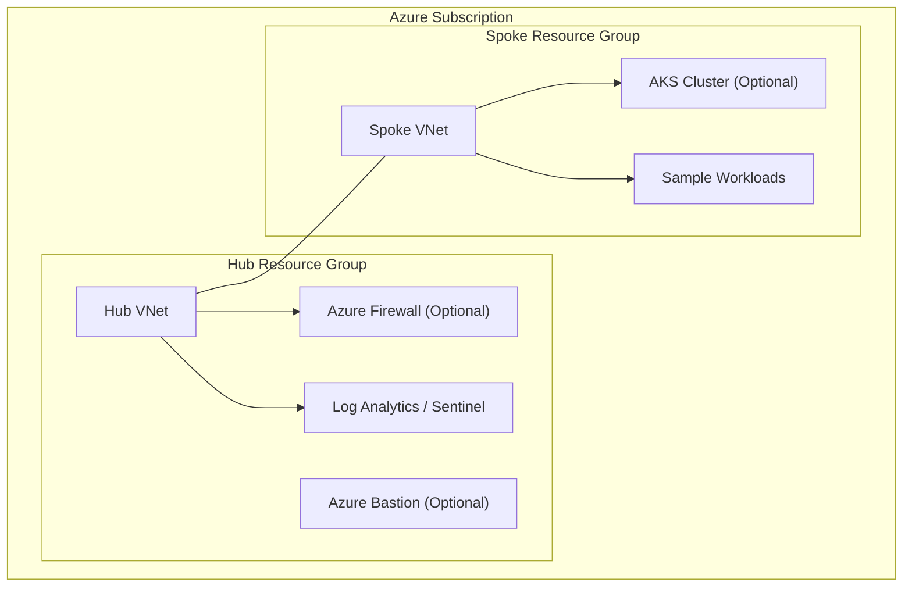

# 🏗️ Architecture Overview

---

## High-Level Design

This project implements a **hub-and-spoke Azure architecture** aligned with enterprise and Zero Trust best practices.

The design separates **shared infrastructure** from **workload environments**, enabling strong isolation, centralized control, and scalable growth.

---

## Logical Architecture Diagram

---

## Design Principles

### 🔒 Security First
- Centralized ingress/egress via hub
- Optional Azure Firewall for traffic inspection
- Private endpoints and private AKS by default
- Identity-driven access (Entra ID / RBAC)

### 🧩 Modularity
- Each component deploys independently
- Features enabled via parameters and workflow toggles
- Easy to extend without refactoring core architecture

### 💸 Cost Awareness
- Expensive services are **explicitly opt-in**
- Safe baseline deployment suitable for labs and demos
- CI/CD enforces intentional resource deployment

### ⚙️ Automation & Governance
- Infrastructure deployed via GitHub Actions (OIDC)
- Azure Policy enforces baseline governance
- Sentinel enables visibility and detection-as-code

---

## Mapping to Real-World Azure Patterns

This architecture mirrors common enterprise patterns:
- Landing zones / platform teams
- Shared services hub
- Isolated application spokes
- Policy-driven governance
- Security operations integration

---

> This document focuses on **architecture intent and structure**.  
> Deployment steps and configuration details are covered in other docs.
