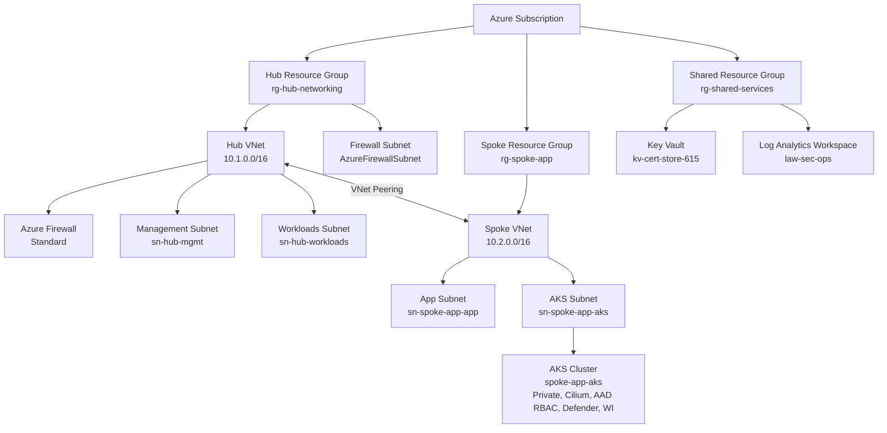

# Azure IaC Foundation — Modular Hub-Spoke Deployment Framework
[](https://github.com/CamParent/iac-foundation/actions/workflows/bicep-validate.yml)

This repository defines a **modular, production-lean Azure infrastructure** built with **Bicep**, following best practices for:

- **Infrastructure-as-Code (IaC)**
- **Hub–spoke network architectures**
- **Azure Policy–driven governance**
- **GitHub Actions CI/CD with OIDC**
- **Optional private AKS cluster with Defender + workload identity**

It’s designed as an **Azure landing zone–style lab** that looks and behaves like a real enterprise environment, while staying cost-conscious.

---

## 🔍 Highlights

- **Modular Bicep Design** – Reusable modules for hub, spoke, firewall, shared services, policy, Defender, and AKS.
- **Hub–Spoke Architecture** – Central hub with shared security services and peered spoke for app workloads.
- **Governance-as-Code** – Custom Azure Policy definitions + assignments deployed via Bicep.
- **Security Integration** – Defender for Cloud, Log Analytics (`law-sec-ops`), and Sentinel-ready telemetry.
- **AKS (Optional)** – Private AKS cluster with Azure CNI Overlay, Cilium dataplane, Azure AD RBAC, Defender, and Workload Identity.
- **CI/CD** – GitHub Actions for:
  - Bicep build + what-if
  - AKS sample app deployment using OIDC and `az aks command invoke`.

> 💡 This repo is both a **learning lab** and a **portfolio-grade reference** for secure Azure infrastructure and Kubernetes design.

---

## Real-World Use Cases

This architecture aligns with Azure Landing Zone and Zero Trust fundamentals:

✔ **Hybrid networking foundations** (hub–spoke, ready for VPN/ExpressRoute)  
✔ **Network isolation & inspection** via Azure Firewall  
✔ **Centralized shared services** (Key Vault, Log Analytics workspace)  
✔ **Governance & compliance** via Azure Policy (regions, tags, IP SKU, AKS controls)  
✔ **Secure AKS workloads** (private API, RBAC, Defender, workload identity)  
✔ **DevSecOps & GitOps ready** through CI/CD + OIDC auth

---

## Architecture


**Key points**:
- **Hub** (rg-hub-networking)
    - Hub VNet, Azure Firewall, management + workloads subnets.
- **Spoke** (rg-spoke-app)
    - App VNet with app + AKS subnet; peered to hub.
    - Optional **private AKS** cluster.
- **Shared Services** (rg-shared-services)
    - Key Vault for secrets/certs.
    - Log Analytics workspace law-sec-ops for Defender + Sentinel.

---

## Repository Layout

```text
.
├── main.bicep                      # Subscription-scope orchestration
├── modules/
│   ├── networking.bicep            # Hub VNet + subnets
│   ├── spoke-networking.bicep      # Spoke VNet + app subnet
│   ├── firewall.bicep              # Azure Firewall deployment
│   ├── keyvault.bicep              # Shared Key Vault (optional)
│   ├── policy.bicep                # Azure Policy (defs + assignments wired to JSON)
│   ├── peering.bicep               # Hub ↔ Spoke VNet peering
│   ├── defender.bicep              # Microsoft Defender
│   └── aks.bicep                   # Optional AKS cluster deployment
├── policies/
│   ├── allowed-locations.json      # Custom policy: restrict regions
│   ├── enforce-tags.json           # Custom policy: require tag keys
│   └── require-standard-publicip.json  # Custom policy: enforce Standard SKU Public IPs
└── .github/
    └── workflows/
        └── bicep-validate.yml      # CI: bicep build + what-if (OIDC login)
```

---

## Prerequisites

- Azure CLI (logged in)  
```bash
az login
```

- Bicep CLI ≥ 0.38
```bash
az bicep version
```

- Permissions to create:
  - Resource Groups
  - VNets
  - Azure Firewall
  - Key Vault
  - (Optional) AKS + Defender

## Validate & Deploy (Base Hub-Spoke)

Preview deployment changes:
```bash
az deployment sub what-if `
  --location eastus2 `
  --template-file .\main.bicep `
  --parameters namePrefixHub=hub namePrefixSpoke=spoke-app
```

Deploy:
```bash
az deployment sub create `
  --location eastus2 `
  --template-file .\main.bicep `
  --parameters namePrefixHub=hub namePrefixSpoke=spoke-app
```

### Expected Results

- rg-hub-networking, rg-spoke-app, rg-shared-services created.
- Hub & spoke VNets provisioned and peered.
- Azure Firewall deployed with standard configuration.
- Shared Key Vault provisioned (if enabled).
- Governance + Defender optional, controlled by parameters (e.g. deployPolicies, deployDefender, deployAks).

## AKS Integration (Optional – Private Cluster)

When deployAks=true, modules/aks.bicep provisions a **private AKS cluster** in the spoke:

### Key Configuration

| Setting | Value |
|--------|-------|
| Cluster Type | Private (no public API) |
| Network Plugin | Azure CNI (Overlay) |
| Dataplane | Cilium |
| Identity | System-assigned |
| Auth | Azure AD with Kubernetes RBAC |
| Node Pool | systemnp – Standard_B2s x1–2 |
| Defender | Enabled and wired to law-sec-ops |
| Workload Identity | Enabled |
| OIDC Issuer | Enabled |

### Deploy Including AKS

```powershell
az deployment sub create `
  --location eastus2 `
  --template-file .\main.bicep `
  --parameters deployAks=true
```

### Validate AKS Cluster (Optional)

```powershell
az aks get-credentials `
  --resource-group rg-spoke-app `
  --name spoke-app-aks

kubectl get nodes
kubectl get pods -A
```

Validation confirms a private AKS control plane, working node connectivity, Cilium dataplane, and Azure AD RBAC integration.

### 🚀 Sample App – Hello World (Manual)

```powershell
az aks command invoke `
  --resource-group rg-spoke-app `
  --name spoke-app-aks `
  --command "kubectl apply -f hello-world.yaml" `
  --file .\samples\aks-basic-deploy\hello-world.yaml
```
Verify pod and service:

```powershell
az aks command invoke `
  --resource-group rg-spoke-app `
  --name spoke-app-aks `
  --command "kubectl get pods -o wide"
```
```powershell
az aks command invoke `
  --resource-group rg-spoke-app `
  --name spoke-app-aks `
  --command "kubectl get svc"
```
Internal connectivity test:

```powershell
az aks command invoke `
  --resource-group rg-spoke-app `
  --name spoke-app-aks `
  --command "kubectl run testpod --rm -it --image=busybox --restart=Never -- wget -O- http://hello-world-service"
```
✔ Confirms:
  - Pod deployment succeeded
  - Service discovery works
  - Azure CNI Overlay + Cilium dataplane routes traffic correctly
  - Private AKS control plane + internal connectivity are functional.

## Workload Identity & OIDC (Security Hardening)

Enabled in aks.bicep:

```bicep
securityProfile: {
  defender: {
    logAnalyticsWorkspaceResourceId: logAnalyticsWorkspaceId
    securityMonitoring: {
      enabled: true
    }
  }
  workloadIdentity: {
    enabled: true
  }
}

oidcIssuerProfile: {
  enabled: true
}
```

This enables pods to authenticate to Azure using **federated tokens** instead of Kubernetes secrets.

### Workload Identity Demo (wi-demo)

A user-assigned managed identity (uai-aks-wi-demo) is created in rg-shared-services and bound to a pod via workload identity:

```yaml
apiVersion: v1
kind: Namespace
metadata:
  name: wi-demo
  labels:
    azure.workload.identity/use: "true"
---
apiVersion: v1
kind: ServiceAccount
metadata:
  name: wi-demo-sa
  namespace: wi-demo
  annotations:
    azure.workload.identity/client-id: "<UAI_CLIENT_ID>"
---
apiVersion: apps/v1
kind: Deployment
metadata:
  name: wi-demo-app
  namespace: wi-demo
spec:
  replicas: 1
  selector:
    matchLabels:
      app: wi-demo-app
  template:
    metadata:
      labels:
        app: wi-demo-app
    spec:
      serviceAccountName: wi-demo-sa
      containers:
        - name: wi-demo
          image: mcr.microsoft.com/oss/busybox/busybox:1.36
          command: ["sh", "-c", "sleep 3600"]
```

Apply and Validate:

```powershell
az aks command invoke `
  --resource-group rg-spoke-app `
  --name spoke-app-aks `
  --command "kubectl apply -f wi-demo.yaml" `
  --file .\samples\aks-basic-deploy\wi-demo.yaml
```

List the token file and environment variables inside the pod:

```powershell
az aks command invoke `
  --resource-group rg-spoke-app `
  --name spoke-app-aks `
  --command "kubectl exec deploy/wi-demo-app -n wi-demo -- sh -c 'ls -R /var/run/secrets/azure/tokens || echo no-token-dir'"

az aks command invoke `
  --resource-group rg-spoke-app `
  --name spoke-app-aks `
  --command "kubectl exec deploy/wi-demo-app -n wi-demo -- sh -c 'env | grep AZURE_ || echo no-azure-env'"
```
✔ Successful validation shows:
  - /var/run/secrets/azure/tokens/azure-identity-token present
  - AZURE_CLIENT_ID, AZURE_FEDERATED_TOKEN_FILE, AZURE_TENANT_ID set

This confirms that **Workload Identity + OIDC issuer** are working as expected and ready for secure pod-to-Azure access (e.g. Key Vault, Storage, Graph, etc.).

---

## Governance & Compliance (Azure Policy)

Governance is expressed **as code** using modules/policy.bicep, which defines and assigns custom Azure Policy at the **subscription scope**.

### Custom Policy Definitions

| Name | Scope | Effect |
|--------|-------|--------|
| custom-allowed-locations | Restrict deployments to eastus2 | `deny` |
| custom-require-standard-publicip | Audit non-Standard SKU Public IPs | `audit` |
| custom-aks-audit-not-private | Audit AKS clusters without private API server | `audit` |
| custom-aks-audit-no-rbac | Audit AKS clusters with RBAC disabled | `audit` |

 ### Policy Assignments (Phase 2 – AKS Governance)

 Assignments are created at subscription scope to enforce cluster security posture:

| Assignment Name | Description |
|--------|-------|
| asg3-allowed-locations | Deny deployments outside eastus2 |
| asg3-require-standard-publicip | Audit Public IPs that are not Standard SKU |
| asg3-aks-audit-not-private | Audit AKS clusters exposing a public API |
| asg3-aks-audit-no-rbac | Audit AKS clusters without Kubernetes RBAC |

Assignments were validated via the ARM REST API:

```powershell
az rest --method get `
  --url "https://management.azure.com/subscriptions/<SUB-ID>/providers/Microsoft.Authorization/policyAssignments?api-version=2022-06-01" `
  --query "value[?starts_with(name, 'asg3-')].{name:name, scope:properties.scope, policyDefinitionId:properties.policyDefinitionId}" `
  -o table
```

This confirms governance is:
  - Centralized at subscription scope
  - Version-controlled in Bicep
  - Validated via what-if before enforcement

---

## Defender for Cloud & Sentinel Readiness

**Defender for Cloud** is enabled for Kubernetes and integrated with the shared workspace:
  - Plan: KubernetesService (Standard)
  - Workspace: law-sec-ops (rg-shared-services)
  - Connected via securityProfile.defender.logAnalyticsWorkspaceResourceId in aks.bicep

This provides:
  - Configuration assessments
  - Threat detection for Kubernetes workloads
  - Security recommendations surfaced via Defender and (optionally) Sentinel

  The environment is **Sentinel-ready**: all necessary telemetry (AKS + Defender + Policy) is flowing into law-sec-ops, and Sentinel rules/workbooks can be layered on in a future phase.

---

## CI/CD – GitHub Actions

This repo uses GitHub Actions with OIDC to validate and interact with the environment.

### 1) Bicep Validation Workflow

/.github/workflows/bicep-validate.yml:
  - Builds all Bicep files
  - Runs az deployment sub what-if against main.bicep
  - Authenticates via azure/login@v2 using OIDC (no stored secrets)

Example result (Run #36):
  - **Creates 7** new resources (policy defs + assignments)
  - **Modifies 7** existing resources (tags, firewall, Key Vault settings)
  - **Ignores ~20** unchanged resources

The workflow ensures every infra change is validated via Azure’s native what-if before deployment.

### 2) AKS Sample App Deployment Workflow

/.github/workflows/aks-deploy.yml deploys the hello-world app to the private AKS cluster.

Key features:

   - Auth via OIDC → azure/login@v2
   - Uses az aks command invoke (works with private control plane)
   - Applies samples/aks-basic-deploy/hello-world.yaml
   - Verifies pods and services

High-level workflow snippet:

```yaml
name: AKS Sample App Deploy

on:
  workflow_dispatch: {}
  push:
    paths:
      - 'samples/aks-basic-deploy/**'
      - '.github/workflows/aks-deploy.yml'

permissions:
  id-token: write
  contents: read

env:
  AZURE_SUBSCRIPTION_ID: ${{ secrets.AZURE_SUBSCRIPTION_ID }}
  AZURE_TENANT_ID:       ${{ secrets.AZURE_TENANT_ID }}
  AZURE_CLIENT_ID:       ${{ secrets.AZURE_CLIENT_ID }}

jobs:
  deploy-hello-world:
    runs-on: ubuntu-latest
    steps:
      - uses: actions/checkout@v4

      - name: Azure login (OIDC)
        uses: azure/login@v2
        with:
          client-id:     ${{ env.AZURE_CLIENT_ID }}
          tenant-id:     ${{ env.AZURE_TENANT_ID }}
          subscription-id: ${{ env.AZURE_SUBSCRIPTION_ID }}

      - name: Deploy hello-world manifest to AKS
        run: |
          az aks command invoke \
            --resource-group rg-spoke-app \
            --name spoke-app-aks \
            --command "kubectl apply -f hello-world.yaml" \
            --file ./samples/aks-basic-deploy/hello-world.yaml
```

✔ The latest run confirmed:
   - OIDC auth succeeded
   - App manifest applied to private cluster
   - Pods and services are reachable inside the cluster

---

## 🚧 Planned Enhancements

 - GitOps for AKS (FluxCD or ArgoCD)
 - Azure Monitor Container Insights + custom metrics
 - AKS autoscaling, ingress controller, and Key Vault CSI driver
 - Additional Azure Policy for pod security / Gatekeeper (OPA)
 - Sentinel analytics rules and dashboards over law-sec-ops
 - Release pipelines for staged infra changes (dev → test → prod)

---

## Author

Cameron Parent — Network & Cloud Engineer • Azure Security Engineer • CISSP

LinkedIn: https://www.linkedin.com/in/camjosephparent/
