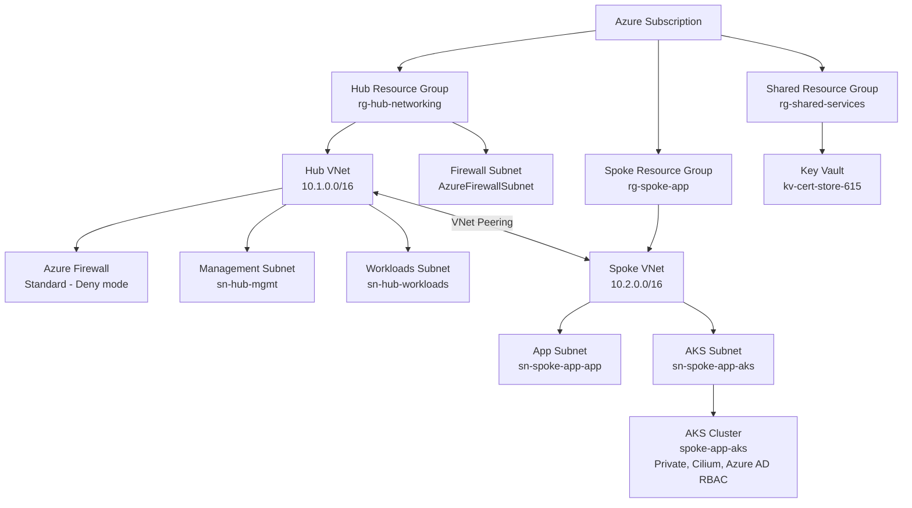

# Azure IaC Foundation — Modular Hub-Spoke Deployment Framework
[](https://github.com/CamParent/iac-foundation/actions/workflows/bicep-validate.yml)

This repository defines a **modular, production-ready Azure infrastructure** built entirely with **Bicep**, following  
best practices for **Infrastructure-as-Code (IaC)** and **GitHub Actions-based CI/CD validation**.

It provisions a **hub-and-spoke network architecture** designed for enterprise workloads—centralizing security, shared services, and network management—while allowing flexible expansion for new applications and environments.

**Highlights**
- **Modular Bicep Design** – Reusable templates for networking, security, and shared services
- **CI/CD Integration** – Automated syntax validation and what-if deployments via GitHub Actions
- **Enterprise-Grade Architecture** – Hub-spoke topology with Azure Firewall, Key Vault, and resource isolation
- **Future-Ready Expansion** – Supports optional integrations such as Bastion, VPN Gateway, and Application Gateway + WAF
- **Private AKS Cluster Deployment (optional)** – Azure Kubernetes Service deployed using modular Bicep, Cilium dataplane, Azure CNI overlay, Azure AD integration with RBAC

💡 This repository demonstrates a fully modular Azure Landing Zone–style infrastructure built using Bicep, showcasing IaC principles, secured hub-spoke networking, CI/CD validation, and optional Kubernetes capability. Designed for enterprise scalability, originally deployed as a hands-on learning and architecture exhibition project.

> 🔄 Full AKS deployment is currently performed manually due to quota limitations and cost control. CI/CD integration for AKS rollout is planned for future enhancements.


---

## Real-World Use Cases

This architecture is designed following enterprise Azure landing zone principles and is suitable for:

✔ **Hybrid Networking:** Hub-spoke topology compatible with VPN/ExpressRoute  
✔ **Zero Trust Expansion:** Centralized firewall, VNet isolation, Azure AD RBAC  
✔ **DevSecOps & GitOps Ready:** CI/CD validation via GitHub OIDC → Azure login  
✔ **Secure AKS Hosting (Optional):** Private cluster with Cilium and Azure AD  
✔ **Future Readiness:** Can extend to multi-region, cluster autoscaling, Azure DevOps pipelines


---

## Architecture


> **Note:** 
AKS deployment is optional via the deployAks=true parameter.
The cluster uses Azure CNI Overlay, Cilium dataplane, system-assigned identity, and private API access via Private Link.
Future proposed integrations: VPN Gateway, Azure Bastion, Application Gateway + WAF, Additional Private Endpoints, and Log Analytics / Azure Monitor.

### Hub Network (`rg-hub-networking`)
- Central VNet for shared infra
- Subnets: `AzureFirewallSubnet`, `sn-hub-mgmt`, `sn-hub-workloads`
- Azure Firewall (Standard or Premium)

### Spoke Network (`rg-spoke-app`)
- Application VNet with dedicated app subnet
- Bidirectional peering with the hub
- Optionally deploys a private AKS cluster (`spoke-app-aks`) using Azure CNI Overlay + Cilium dataplane
- AKS control plane exposed via `privatelink`, not publicly accessible
- Secured via Azure AD + Kubernetes RBAC

### Shared Services (`rg-shared-services`)
- Azure Key Vault for certificates and secrets

**Future-ready**: VPN/ExpressRoute Gateways, Bastion, Application Gateway + WAF, Private Endpoints.

---

## Repository Layout

```text
.
├── main.bicep                      # Subscription-scope orchestration
├── modules/
│   ├── networking.bicep            # Hub VNet + subnets
│   ├── spoke-networking.bicep      # Spoke VNet + app subnet
│   ├── firewall.bicep              # Azure Firewall deployment
│   ├── keyvault.bicep              # Shared Key Vault (optional)
│   ├── policy.bicep                # Azure Policy (defs + assignments wired to JSON)
│   ├── peering.bicep               # Hub ↔ Spoke VNet peering
│   └── aks.bicep                   # Optional AKS cluster deployment
├── policies/
│   ├── allowed-locations.json      # Custom policy: restrict regions
│   ├── enforce-tags.json           # Custom policy: require tag keys
│   └── require-standard-publicip.json  # Custom policy: enforce Standard SKU Public IPs
└── .github/
    └── workflows/
        └── bicep-validate.yml      # CI: bicep build + what-if (OIDC login)
```

---

## Prerequisites

- Azure CLI (logged in)  
```bash
az login
```

- Bicep CLI ≥ 0.38
```bash
az bicep version
```

- Permissions to create:
  - Resource Groups
  - Virtual Networks
  - Azure Firewall
  - Key Vault

## Validate

Preview deployment changes:
```bash
az deployment sub what-if `
  --location eastus2 `
  --template-file .\main.bicep `
  --parameters namePrefixHub=hub namePrefixSpoke=spoke-app
```

## Deploy
```bash
az deployment sub create `
  --location eastus2 `
  --template-file .\main.bicep `
  --parameters namePrefixHub=hub namePrefixSpoke=spoke-app
```

## Expected Results

- Hub and Spoke VNets created and peered
- Azure Firewall with static public IP
- Optional Key Vault provisioned
- Optional **private AKS cluster deployed** with Cilium and Azure AD RBAC (if `deployAks=true`)
- Consistent tagging across resource groups

## AKS Integration (Optional – Lab-Grade Private Cluster)

This project includes an optional AKS deployment using modular Bicep.

📌 The AKS module was added to demonstrate capability in deploying secure enterprise Kubernetes workloads using Infrastructure-as-Code principles — a highly sought skill in cloud engineering and DevSecOps roles. The configuration mirrors production-grade practices while remaining cost-conscious for lab use.


### Key Configuration
| Setting | Value |
|--------|-------|
| Cluster Type | Private |
| Network Plugin | Azure CNI (Overlay) |
| Dataplane | Cilium |
| Identity | System-assigned |
| Auth | Azure AD with Kubernetes RBAC |
| Node Pool Size | 1× Standard_B2s (autoscale off for lab use) |
| Deployment Trigger | `deployAks=true` |

### Example deployment including AKS

The AKS module is only provisioned when explicitly enabled using `deployAks=true`.  
When this parameter is `false` or omitted, the spoke VNet is created **without** any Kubernetes resources.

```powershell
az deployment sub create `
  --location eastus2 `
  --template-file .\main.bicep `
  --parameters deployAks=true
```

### Validate AKS Cluster

```powershell
az aks get-credentials `
  --resource-group rg-spoke-app `
  --name spoke-app-aks

kubectl get nodes
kubectl get pods -A
```

Validation confirms a private AKS control plane, working node connectivity, Cilium dataplane, and Azure AD RBAC integration.

### 🚀 Deploy Sample Application (Hello World)

Once the AKS cluster is deployed and validated, a simple test application was deployed to confirm pod scheduling, internal service routing, and pod-to-pod network communication over Azure CNI Overlay + Cilium dataplane.

```powershell
az aks command invoke `
  --resource-group rg-spoke-app `
  --name spoke-app-aks `
  --command "kubectl apply -f hello-world.yaml" `
  --file .\samples\aks-basic-deploy\hello-world.yaml
```
Verify the pod and service:

```powershell
az aks command invoke `
  --resource-group rg-spoke-app `
  --name spoke-app-aks `
  --command "kubectl get pods -o wide"
```
```powershell
az aks command invoke `
  --resource-group rg-spoke-app `
  --name spoke-app-aks `
  --command "kubectl get svc"
```
Test internal connectivity from within the cluster:

```powershell
az aks command invoke `
  --resource-group rg-spoke-app `
  --name spoke-app-aks `
  --command "kubectl run testpod --rm -it --image=busybox --restart=Never -- wget -O- http://hello-world-service"
```
✔️ Successful output:
The cluster successfully returned a static HTML response:

```css
Welcome to Azure Container Service (AKS)
```
This confirms:
- Pod deployment succeeded
- Network routing via CNI Overlay is functional
- Private service resolution worked
- Internal pod-to-service connectivity validated using wget from a test pod

### 🧠 Why this location?
- It continues the flow: *Cluster validated → Application tested*
- Demonstrates functional proof-of-deployment
- Highlights Azure CNI Overlay + Cilium success
- Shows practical use of `az aks command invoke` due to private cluster

🛡️ *Because the AKS cluster is private, direct access requires either Azure Bastion/Jumpbox, VPN/ExpressRoute, or using `az aks command invoke` as demonstrated above.*

> ⚙️ **Lab Deployment Recommendation:** The AKS cluster intentionally uses a single `Standard_B2s` node with no autoscale to minimize cost during testing. Scale for production workloads.

---

## CI/CD – Automated AKS Deployment via GitHub Actions

This repository now includes a GitHub Actions workflow (`aks-deploy.yml`) that automatically deploys a sample app to the AKS cluster using OIDC authentication and `az aks command invoke`.

| Feature | Value |
|--------|-------|
| Authentication | OpenID Connect (OIDC) — no stored credentials |
| Trigger | Manual (`workflow_dispatch`) or file changes |
| Deployment Target | Private AKS Cluster (`spoke-app-aks`) |
| Manifest Source | `samples/aks-basic-deploy/hello-world.yaml` |

### 🚀 Workflow Execution

```yaml
name: AKS Sample App Deploy
permissions:
  id-token: write   # Required for OIDC → Azure
  contents: read

jobs:
  deploy-hello-world:
    runs-on: ubuntu-latest
    steps:
      - uses: actions/checkout@v4
      - uses: azure/login@v2
        with:
          client-id:     ${{ env.AZURE_CLIENT_ID }}
          tenant-id:     ${{ env.AZURE_TENANT_ID }}
          subscription-id: ${{ env.AZURE_SUBSCRIPTION_ID }}

      - name: Deploy app
        run: |
          az aks command invoke \
            --resource-group rg-spoke-app \
            --name spoke-app-aks \
            --command "kubectl apply -f hello-world.yaml" \
            --file ./samples/aks-basic-deploy/hello-world.yaml

### 📊 Latest Deployment Result

✔ Workflow **passed successfully**  
✔ Pod scheduled successfully  
✔ Internal service resolution confirmed  
✔ CNI Overlay + Cilium dataplane fully operational  
✔ Validated without any need for kubeconfig access

> _A private AKS cluster with OIDC-enabled GitHub automation is fully functional — demonstrating secure DevOps practices using cloud-native CI/CD._

---

## Governance & Compliance (Azure Policy)

Governance is applied using modular Bicep in the same way as infrastructure — ensuring policy is version-controlled, peer-reviewed, and validated with what-if before enforcement.

This infrastructure enforces foundational governance controls using **Azure Policy** at the **subscription scope** to standardize security configuration and proactively audit misaligned resources.

### 🔒 Policy Controls Included

| Policy | Scope | Effect |
|--------|-------|--------|
| ❌ Deny deployments outside approved region (`eastus2`) | All resources | `deny` |
| 🔍 Audit missing `environment` / `owner` tags | All resources | `audit` |
| 🔍 Audit Public IPs not using **Standard SKU** | Networking | `audit` |
| 🔍 Audit AKS clusters without **Private API access** | Kubernetes | `audit` |
| 🔍 Audit AKS clusters with **RBAC disabled** | Kubernetes | `audit` |

📦 These policy definitions and assignments are implemented through  
`modules/policy.bicep` and activated by using:

```powershell
--parameters deployPolicies=true
```

🔄 Policy Lifecycle via IaC

✔️ Policies are provisioned and assigned as part of the Bicep deployment
✔️ Included in CI/CD validation (what-if preview)
✔️ Can be extended using Azure Policy initiatives for Hub-Spoke landing zones

🧠 Why this matters

This aligns the environment with Zero Trust, Cloud Adoption Framework (CAF), and Landing Zone best practices, ensuring every deployment remains compliant regardless of contributor.

📊 Validation Result

Validate Azure Policy assignments
```powershell
az policy assignment list --query "[].{name:name, policy:policyDefinitionId}" -o table
```

(Optional) View compliance state
```powershell
az policy state summarize --management-group <mgmt-group-if-used> --query "results[0].nonCompliantResources"
```

Recent what-if CI/CD run confirms:
- 7 new policy resources created
- 7 existing resources modified to meet compliance
- No breaking changes introduced

Effectively, this project enforces governance guardrails without blocking lab deployment.

## CI/CD Integration

This repository includes a GitHub Actions workflow that:

- Runs syntax validation on all Bicep templates
- Executes an automated Azure “what-if” deployment preview
- Authenticates securely using OpenID Connect (OIDC) federation with Azure

✔ GitHub Actions authenticates securely using **OIDC (no static secrets)** and enforces ARM what-if validation before any deployment.

### 📘 CI/CD Validation Results

The latest **automated what-if deployment** was executed via GitHub Actions using OpenID Connect authentication.

✅ **Run #36** — [View Workflow Logs »](https://github.com/CamParent/iac-foundation/actions/runs/19154923538)  
📦 **Artifact:** [Download what-if-36.zip](https://github.com/CamParent/iac-foundation/actions/runs/19154923538#artifacts)

The `what-if` output confirms that the deployment would:
- **Create 7** new resources (custom Azure Policy Definitions + Assignments)
- **Modify 7** existing resources (resource group tagging, hub firewall, and Key Vault RBAC)
- **Ignore 20** unchanged resources (existing networking, routes, private endpoints, etc.)

**Highlights:**
- Enforces **Allowed Locations**, **Required Tags**, and **Standard SKU Public IP** Azure Policies  
- Adds consistent resource tagging across all resource groups  
- Updates Azure Firewall to **AlertAndDeny** mode with refined subnets  
- Enables **RBAC authorization** and **purge protection** in Key Vault  

> _This validation was fully automated through GitHub Actions, ensuring every infrastructure change is tested through Azure’s native “what-if” before deployment._

## Planned Enhancements

- Integrate GitOps with Azure Kubernetes Service using FluxCD or ArgoCD
- Enable Azure Monitor / Container Insights for cluster observability
- Add autoscaling, ingress controller, and Azure Key Vault CSI driver
- Configure Azure DevOps or GitHub Release workflow for cluster lifecycle

This project was fully architected, developed, and tested independently as part of my Azure Infrastructure-as-Code learning path and lab-to-production validation strategy.

## Author

Cameron Parent — Network & Cloud Engineer • Azure Security Engineer • CISSP

LinkedIn: https://www.linkedin.com/in/camjosephparent/
