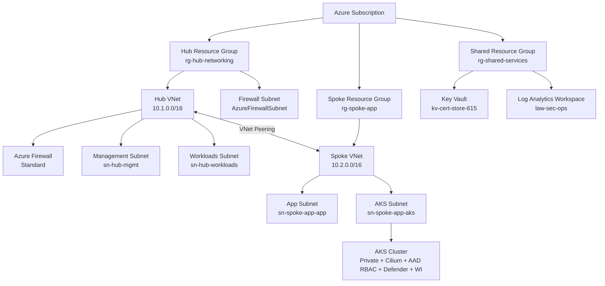

# Azure IaC Foundation — Modular Hub-Spoke Deployment Framework
[](https://github.com/CamParent/iac-foundation/actions/workflows/deploy.yml)
[](https://github.com/CamParent/iac-foundation/actions/workflows/aks-deploy.yml)
[](https://github.com/CamParent/iac-foundation/actions/workflows/sentinel-rule-deploy.yaml)

This repository defines a **modular, production-lean Azure infrastructure** using **Bicep**, **GitHub Actions**, and **Azure-native governance** principles.

It provides a complete Azure landing zone with CI/CD, secure AKS, and Microsoft Sentinel integration — designed for:
  - Security-conscious deployments
  - DevSecOps pipelines (OIDC-based)
  - Policy-driven governance
  - Sentinel automation and telemetry readiness

---

## 🔍 Highlights

- **Bicep-based modular architecture** (Hub/Spoke/AKS/Policy/Firewall)
- **Private AKS cluster** with Cilium, AAD RBAC, Defender, Workload Identity
- **GitHub Actions CI/CD** for:
  - Infra validation/deployment
  - AKS workload deployment
  - Sentinel Analytics automation
- **Azure Policy as code** for region/tag/AKS enforcement
- **Microsoft Sentinel**: rules, ingestion lab, and automation workflows

---

## Terraform Variant (Hub–Spoke Lab)

In addition to the Bicep-based landing zone, this repo includes a small
Terraform implementation under [`/terraform`](./terraform):

- `terraform/modules/networking` – hub resource group + virtual network
- `terraform/modules/spoke-networking` – spoke resource group + virtual network + hub–spoke peering
- `terraform/envs/lab` – opinionated lab environment that deploys:
  - `rg-hub-networking-tf` / `vnet-hub-01-tf`
  - `rg-spoke-apps-tf` / `vnet-spoke-01-tf`
  - bidirectional VNet peering between hub and spoke

This is intentionally scoped to demonstrate that the same hub–spoke design can
be expressed with both **Bicep** and **Terraform**, using modular patterns in each.

---

## 💸 Cost Controls & Safe Lab Deployment (Intentionally Designed)

This project includes **first-class cost governance** to ensure the environment remains affordable for personal use while still showcasing production-grade architecture.

Because Azure Firewall, AKS nodepools, and Defender plans can become expensive, this IaC framework implements **toggle-based cost control** across Bicep and GitHub Actions.

### 🔧 Deploy-Time Feature Toggles (Bicep Parameters)

Each major component is **opt-in**, allowing you to deploy only what you need:

| Feature                     | Parameter                  | Default | Notes                                                   |
|-----------------------------|----------------------------|---------|---------------------------------------------------------|
| **Azure Firewall (expensive)** | `deployFirewall`           | `false` | Prevents accidental $300–$1000/mo charges               |
| **AKS Cluster**             | `deployAks`                | `false` | No nodes = no VM cost; deploy only when needed          |
| **Defender for Cloud (AKS)**| `deployDefender`           | `false` | Avoids Defender plan charges per resource                |
| **Azure Container Registry**| `deployAcr`                | `false` | Optional ACR for AKS workloads                           |
| **Sentinel Analytics Rules**| `deploySentinelAnalytics`  | `false` | Heavy log ingestion left optional                       |
| **Sentinel Workbook**       | `deploySentinelWorkbook`   | `true`  | Visual SOC overview included by default                 |

### 🚦 Cost Controls Integrated Into GitHub Actions (`deploy.yml`)

The CI/CD workflow exposes the same toggles via **workflow_dispatch** inputs, allowing you to choose the appropriate cost level for each deployment:

| Mode | Description |
|------|-------------|
| **Cheap Mode** | Deploys only hub, spoke, Log Analytics, Key Vault, and Sentinel Workbook |
| **Full Demo Mode** | Optionally deploys AKS, Azure Firewall, Defender for Cloud, ACR, analytics rules, etc. |
| **Hybrid Mode** | Mix-and-match: e.g., deploy AKS but skip Firewall, or deploy Sentinel but skip Defender |

**Example GitHub Actions UI:**

[ ] Deploy Azure Firewall (expensive)
[x] Deploy Sentinel Workbook
[ ] Deploy Sentinel Analytics
[ ] Deploy AKS Cluster
[ ] Enable Defender for Cloud (AKS)

This ensures you **never accidentally deploy costly resources** during normal iteration or development cycles.

### 🧠 Cost Toggle Flow (GitHub Actions → Bicep → Azure)


This flow demonstrates how GitHub Actions inputs drive Bicep parameters, which in turn conditionally deploy (or skip) costly resources — turning cost governance into code.

### 🛡️ Why This Matters (Real-World Skill)

Cost governance is a core cloud engineering responsibility — and this project intentionally demonstrates:

- **Cost-aware IaC design**
- **Predictable spend controls**
- **Safe CI/CD deployments**
- **Modular governance patterns**
- **Guardrails to prevent accidental overspend**

These capabilities directly translate to enterprise best practices.  
Hiring managers immediately see that you know how to:

- Secure an environment  
- Automate deployments  
- **Control cloud spend effectively**

This is especially critical in Azure environments where misconfigured deployments can easily exceed hundreds of dollars per month.

### 👍 Expected Monthly Cost (Cheap Mode)

With `deployFirewall=false` and `deployAks=false`, the baseline environment stays very affordable:

| Component | Estimated Cost |
|-----------|----------------|
| Log Analytics (30 days retention) | ~$2–$5 |
| Key Vault | ~$1 |
| Storage + misc | ~$1–$2 |
| Resource groups, VNets, route tables | **$0** |

**Total:** **~$5–$10 per month**

Full demo mode costs more (AKS nodepools, Firewall, Defender),  
but only when **intentionally enabled** through the CI/CD toggles.

---

## 🌎 Architecture Overview



---

## 🔮 Repository Structure

```text
.
├── main.bicep                      # Subscription-scope entrypoint
├── modules/                        # Reusable infra modules
│   ├── networking.bicep            # Hub VNet
│   ├── spoke-networking.bicep      # Spoke VNet
│   ├── firewall.bicep              # Azure Firewall
│   ├── keyvault.bicep              # Shared Key Vault
│   ├── policy.bicep                # Policy definitions + assignments
│   ├── peering.bicep               # Hub ↔ Spoke peering
│   ├── defender.bicep              # Defender integration
│   └── aks.bicep                   # AKS cluster (optional)
├── policies/                       # JSON policies used by policy.bicep
├── sentinel/
│   ├── analytics/                  # Sentinel analytic rule templates (JSON)
│   ├── ingest-lab/                 # Simulated ingestion via DCR + AMA
│   └── workbooks/                  # Workbook definitions (JSON)
└── .github/workflows/
    ├── deploy.yml                  # Infra validation & deploy (Bicep what-if)
    ├── aks-deploy.yml              # Sample app deployment to AKS
    └── sentinel-rule-deploy.yaml    # Sentinel automation with validation
```

---

## 🚀 GitHub Actions (CI/CD)
 
### Infra Deployment: deploy.yml
  - Runs on push or manual dispatch
  - Validates Bicep syntax
  - Performs what-if against subscription
  - Deploys infrastructure on approval

### AKS App Deploy: aks-deploy.yml
  - Deploys sample app (hello-world.yaml) to private AKS
  - Authenticates via OIDC
  - Uses az aks command invoke to reach private cluster

### Sentinel Rules: sentinel-rule-deploy.yaml
  - Validates JSON structure + required tags
  - Deploys all .json rules from sentinel/analytics/
  - Uses az rest + OIDC login

Validation step ensures rules include mandatory metadata:

```json
"tags": {
"Environment": "lab",
"Owner": "cparent",
"Project": "iac-foundation",
"DeployedBy": "github-actions"
}
```

---

## 🚒 Optional AKS Cluster

Deployed with deployAks=true, this cluster includes:

| Feature | Value |
|--------|-------|
| Type | Private |
| CNI | Azure CNI (Overlay) |
| Dataplane | Cilium |
| RBAC | Azure AD RBAC |
| Defender | Enabled |
| Workload Identity | Enabled |
| OIDC | Enabled |

Sample deployments:

```bash
az aks command invoke \
--resource-group rg-spoke-app \
--name spoke-app-aks \
--command "kubectl apply -f hello-world.yaml" \
--file ./samples/aks-basic-deploy/hello-world.yaml
```

---

## Sentinel Automation & Ingest Lab

Sentinel-ready telemetry flows into law-sec-ops from:
  - Azure Firewall logs
  - Defender for Cloud (AKS)
  - AMA from sentinelvm01 via DCR (ingest lab)

### Analytics Rule Deployment
  - Rules live in sentinel/analytics/
  - Deployed via az rest
  - GitHub Action enforces tag compliance and structure

### Ingestion Lab
  - sentinelvm01 Windows VM runs test log generato
  - Data Collection Rule (DCR) + AMA collects Security logs
  - Logs visible in Sentinel workspace via KQL

---

## ⚖️ Governance-as-Code (Azure Policy)

Deployed via policy.bicep:

| Name | Description |
|--------|-------|
| custom-allowed-locations | Restrict to eastus2 |
| custom-require-standard-publicip | Audit non-Standard IPs |
| custom-aks-audit-not-private | Audit public AKS API |
| custom-aks-audit-no-rbac | Audit AKS clusters with RBAC off |

Assignments (asg3-*) scoped at subscription level.

---

## Author

Cameron Parent — Network & Cloud Engineer • Azure Security Engineer • CISSP

LinkedIn: https://www.linkedin.com/in/camjosephparent/