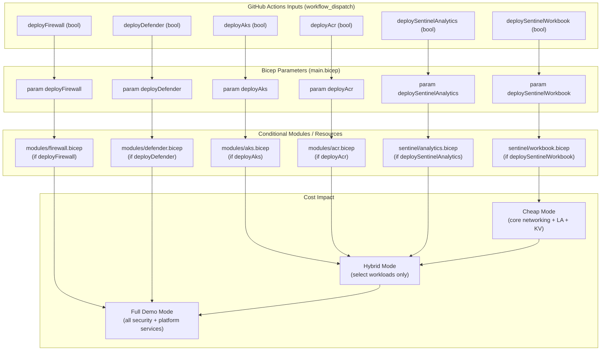
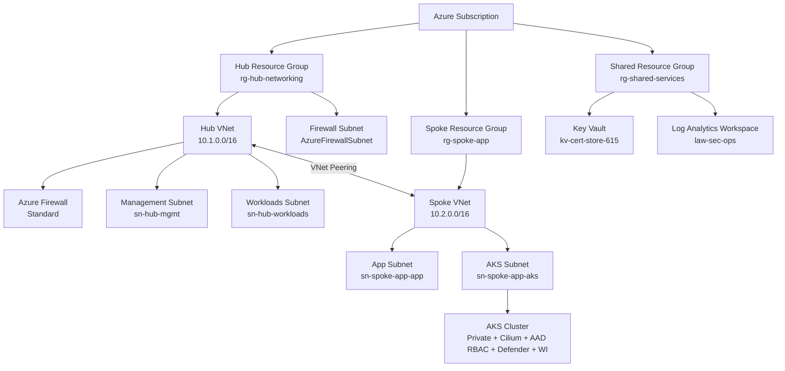

# Azure IaC Foundation — Modular Hub-Spoke Deployment Framework
[](https://github.com/CamParent/iac-foundation/actions/workflows/deploy.yml)
[](https://github.com/CamParent/iac-foundation/actions/workflows/aks-deploy.yml)
[](https://github.com/CamParent/iac-foundation/actions/workflows/sentinel-rule-deploy.yaml)
[](https://github.com/CamParent/iac-foundation/actions/workflows/terraform-plan.yml)
[](https://github.com/CamParent/iac-foundation/actions/workflows/terraform-aws-hub-spoke.yml)

This repository defines a **modular, production-lean Azure infrastructure** using **Bicep**, **GitHub Actions**, and **Azure-native governance** principles.

It provides a complete Azure landing zone with CI/CD, secure AKS, and Microsoft Sentinel integration — designed for:
  - Security-conscious deployments
  - DevSecOps pipelines (OIDC-based)
  - Policy-driven governance
  - Sentinel automation and telemetry readiness

---

## 🔍 Highlights

- **Bicep-based modular architecture** (Hub/Spoke/AKS/Policy/Firewall)
- **Private AKS cluster** with Cilium, AAD RBAC, Defender, Workload Identity
- **GitHub Actions CI/CD** for:
  - Infra validation/deployment
  - AKS workload deployment
  - Sentinel Analytics automation
- **Azure Policy as code** for region/tag/AKS enforcement
- **Microsoft Sentinel**: rules, ingestion lab, and automation workflows

---

## Terraform Variant (Hub–Spoke + AKS + OIDC CI/CD)

This repository includes a **parallel Terraform implementation** of the core  
hub–spoke landing zone under [`/terraform`](./terraform).  
It mirrors the same enterprise networking and cost-governance principles used
in the Bicep-based deployment.

### 📁 Terraform Structure

- `terraform/modules/networking` – Hub RG + Hub VNet  
- `terraform/modules/spoke-networking` – Spoke RG + Spoke VNet + bidirectional peering  
- `terraform/modules/aks` – Optional AKS cluster with subnet injection + cost toggle  
- `terraform/envs/lab` – Opinionated lab environment wiring all Terraform modules together  

When deployed, the lab creates:

- `rg-hub-networking-tf` / `vnet-hub-01-tf`
- `rg-spoke-apps-tf` / `vnet-spoke-01-tf`
- Hub ↔ Spoke VNet peering
- **Optional** AKS cluster in the spoke VNet

---

### 🚦 Terraform AKS Cost Toggle

AKS is intentionally **opt-in** for cost safety:

| Variable | Default | Behavior |
|---------|---------|-----------|
| `deploy_aks` | `false` | Deploys only hub + spoke + peering |
| `deploy_aks` | `true`  | Adds AKS cluster + AKS subnet |

Example commands:

```bash
# Baseline hub–spoke only (cheap mode)
terraform apply

# Full demo mode with AKS (costs money)
terraform apply -var "deploy_aks=true"

# Remove AKS but keep networking
terraform apply -var "deploy_aks=false"

# Destroy entire Terraform lab
terraform destroy -var "deploy_aks=true"
```

To control cloud spend, the Terraform lab is **kept destroyed by default** and
is only deployed **intentionally for demos or validation**.

---

### 🔁 Terraform CI/CD (OIDC-Based, Read-Only)

A dedicated GitHub Actions workflow continuously validates Terraform:

`.github/workflows/terraform-plan.yml`

This workflow runs:

- `terraform init`
- `terraform fmt`
- `terraform validate`
- `terraform plan`

using **Azure Workload Identity (OIDC)** with **no stored secrets**.

The workflow exposes a UI toggle:

[ ] Include AKS in Terraform plan (costs money if applied)

This allows **safe previewing of AKS-related infrastructure changes without
applying them**.

---

### 🛡️ Why Terraform Is Included

Terraform is included to demonstrate:

- **Multi-IaC proficiency** (Bicep + Terraform)
- **Provider-driven Azure automation**
- **Modular Terraform design**
- **Hub–spoke networking expressed in both languages**
- **Cost-aware optional workloads**
- **OIDC-based CI/CD authentication**

This mirrors how real enterprise platform teams often support **both native
and third-party IaC tooling side-by-side**.

---

## 💸 Cost Controls & Safe Lab Deployment (Intentionally Designed)

This project includes **first-class cost governance** to ensure the environment remains affordable for personal use while still showcasing production-grade architecture.

Because Azure Firewall, AKS nodepools, and Defender plans can become expensive, this IaC framework implements **toggle-based cost control** across Bicep and GitHub Actions.

### 🔧 Deploy-Time Feature Toggles (Bicep Parameters)

Each major component is **opt-in**, allowing you to deploy only what you need:

| Feature                     | Parameter                  | Default | Notes                                                   |
|-----------------------------|----------------------------|---------|---------------------------------------------------------|
| **Azure Firewall (expensive)** | `deployFirewall`           | `false` | Prevents accidental $300–$1000/mo charges            |
| **AKS Cluster**                | `deployAks`                | `false` | No nodes = no VM cost; deploy only when needed       |
| **Defender for Cloud (AKS)**   | `deployDefender`           | `false` | Avoids Defender plan charges per resource            |
| **Azure Container Registry**   | `deployAcr`                | `false` | Optional ACR for AKS workloads                       |
| **Sentinel Analytics Rules**   | `deploySentinelAnalytics`  | `false` | Heavy log ingestion left optional                    |
| **Sentinel Workbook**          | `deploySentinelWorkbook`   | `true`  | Visual SOC overview included by default              |

### 🚦 Cost Controls Integrated Into GitHub Actions (`deploy.yml`)

The CI/CD workflow exposes the same toggles via **workflow_dispatch** inputs, allowing you to choose the appropriate cost level for each deployment:

| Mode | Description |
|------|-------------|
| **Cheap Mode** | Deploys only hub, spoke, Log Analytics, Key Vault, and Sentinel Workbook |
| **Full Demo Mode** | Optionally deploys AKS, Azure Firewall, Defender for Cloud, ACR, analytics rules, etc. |
| **Hybrid Mode** | Mix-and-match: e.g., deploy AKS but skip Firewall, or deploy Sentinel but skip Defender |

**Example GitHub Actions UI:**

[ ] Deploy Azure Firewall (expensive)
[x] Deploy Sentinel Workbook
[ ] Deploy Sentinel Analytics
[ ] Deploy AKS Cluster
[ ] Enable Defender for Cloud (AKS)

This ensures you **never accidentally deploy costly resources** during normal iteration or development cycles.

### 🧠 Cost Toggle Flow (GitHub Actions → Bicep → Azure)



This flow demonstrates how GitHub Actions inputs drive Bicep parameters, which in turn conditionally deploy (or skip) costly resources — turning cost governance into code.

### 🛡️ Why This Matters (Real-World Skill)

Cost governance is a core cloud engineering responsibility — and this project intentionally demonstrates:

- **Cost-aware IaC design**
- **Predictable spend controls**
- **Safe CI/CD deployments**
- **Modular governance patterns**
- **Guardrails to prevent accidental overspend**

These capabilities directly translate to enterprise best practices.  
Hiring managers immediately see that you know how to:

- Secure an environment  
- Automate deployments  
- **Control cloud spend effectively**

This is especially critical in Azure environments where misconfigured deployments can easily exceed hundreds of dollars per month.

### 👍 Expected Monthly Cost (Cheap Mode)

With `deployFirewall=false` and `deployAks=false`, the baseline environment stays very affordable:

| Component | Estimated Cost |
|-----------|----------------|
| Log Analytics (30 days retention) | ~$2–$5 |
| Key Vault | ~$1 |
| Storage + misc | ~$1–$2 |
| Resource groups, VNets, route tables | **$0** |

**Total:** **~$5–$10 per month**

Full demo mode costs more (AKS nodepools, Firewall, Defender),  
but only when **intentionally enabled** through the CI/CD toggles.

---

## 🌎 Architecture Overview



---

## 🔮 Repository Structure

```text
.
├── main.bicep                      # Subscription-scope entrypoint
├── modules/                        # Reusable infra modules
│   ├── networking.bicep            # Hub VNet
│   ├── spoke-networking.bicep      # Spoke VNet
│   ├── firewall.bicep              # Azure Firewall
│   ├── keyvault.bicep              # Shared Key Vault
│   ├── policy.bicep                # Policy definitions + assignments
│   ├── peering.bicep               # Hub ↔ Spoke peering
│   ├── defender.bicep              # Defender integration
│   └── aks.bicep                   # AKS cluster (optional)
├── policies/                       # JSON policies used by policy.bicep
├── sentinel/
│   ├── analytics/                  # Sentinel analytic rule templates (JSON)
│   ├── ingest-lab/                 # Simulated ingestion via DCR + AMA
│   └── workbooks/                  # Workbook definitions (JSON)
└── .github/workflows/
    ├── deploy.yml                  # Azure infra validation & deploy (Bicep + what-if)
    ├── aks-deploy.yml              # Sample app deployment to AKS
    ├── sentinel-rule-deploy.yaml   # Sentinel analytics deployment with validation
    ├── terraform-plan.yml          # Azure Terraform plan (OIDC to Azure)
    └── terraform-aws-hub-spoke.yml # AWS Terraform plan (OIDC to AWS)
```

---

## 🚀 GitHub Actions (CI/CD)
 
### Infra Deployment: deploy.yml
  - Runs on push or manual dispatch
  - Validates Bicep syntax
  - Performs what-if against subscription
  - Deploys infrastructure on approval

### AKS App Deploy: aks-deploy.yml
  - Deploys sample app (hello-world.yaml) to private AKS
  - Authenticates via OIDC
  - Uses az aks command invoke to reach private cluster

### Sentinel Rules: sentinel-rule-deploy.yaml
  - Validates JSON structure + required tags
  - Deploys all .json rules from sentinel/analytics/
  - Uses az rest + OIDC login

Validation step ensures rules include mandatory metadata:

```json
"tags": {
"Environment": "lab",
"Owner": "cparent",
"Project": "iac-foundation",
"DeployedBy": "github-actions"
}
```

---

## 🚒 Optional AKS Cluster

Deployed with deployAks=true, this cluster includes:

| Feature | Value |
|--------|-------|
| Type | Private |
| CNI | Azure CNI (Overlay) |
| Dataplane | Cilium |
| RBAC | Azure AD RBAC |
| Defender | Enabled |
| Workload Identity | Enabled |
| OIDC | Enabled |

Sample deployments:

```bash
az aks command invoke \
--resource-group rg-spoke-app \
--name spoke-app-aks \
--command "kubectl apply -f hello-world.yaml" \
--file ./samples/aks-basic-deploy/hello-world.yaml
```

---

## Sentinel Automation & Ingest Lab

Sentinel-ready telemetry flows into law-sec-ops from:
  - Azure Firewall logs
  - Defender for Cloud (AKS)
  - AMA from sentinelvm01 via DCR (ingest lab)

### Analytics Rule Deployment
  - Rules live in sentinel/analytics/
  - Deployed via az rest
  - GitHub Action enforces tag compliance and structure

### Ingestion Lab
  - sentinelvm01 Windows VM runs test log generator
  - Data Collection Rule (DCR) + AMA collects Security logs
  - Logs visible in Sentinel workspace via KQL

---

## ⚖️ Governance-as-Code (Azure Policy)

Deployed via policy.bicep:

| Name | Description |
|------|-------------|
| custom-allowed-locations | Restrict to eastus2 |
| custom-require-standard-publicip | Audit non-Standard IPs |
| custom-aks-audit-not-private | Audit public AKS API |
| custom-aks-audit-no-rbac | Audit AKS clusters with RBAC off |

Assignments (asg3-*) scoped at subscription level.

---

---

## ☁️ AWS Hub–Spoke + SSM Lab (Terraform)

In addition to Azure, this repo includes a small **AWS hub–spoke lab** managed with Terraform under:

- `terraform/aws/hub-spoke-ssm/`

This environment is designed to showcase:

- **Bringing brownfield AWS infra under Terraform** via `terraform import`
- **Hub–spoke VPC design** using an **AWS Transit Gateway**
- **Private management** using **AWS Systems Manager (Session Manager)** and interface endpoints
- **S3 access via VPC gateway endpoints** from private subnets
- **ICMP-only lab paths** for clean, controlled connectivity testing

---

### 🧱 AWS Lab Topology

**Region:** `us-east-2`  
**Addressing:**

- **Hub VPC** – `10.0.0.0/16` (`aws_vpc.hub`)
- **Spoke VPC** – `10.1.0.0/16` (`aws_vpc.spoke`)

**Hub VPC:**

- Private subnets in `us-east-2a` and `us-east-2b`  
  - `hub-private-a-1`, `hub-private-a-2`  
  - `hub-private-b-1`, `hub-private-b-2`
- Internet Gateway: `hub-igw`
- Route tables:
  - `hub-rtb-public` – 0.0.0.0/0 → IGW, 10.1.0.0/16 → Transit Gateway
  - `hub-rtb-private1-us-east-2a` – 10.1.0.0/16 → Transit Gateway
  - `hub-rtb-private2-us-east-2b` – 10.1.0.0/16 → Transit Gateway
  - `hub_main` – default main table

**Spoke VPC:**

- Public subnets (for optional future workloads)
  - `spoke-subnet-public1-us-east-2a`
  - `spoke-subnet-public2-us-east-2b`
- Private subnets
  - `spoke-subnet-private1-us-east-2a`
  - `spoke-subnet-private2-us-east-2b`
- Internet Gateway: `spoke-igw`
- Route tables:
  - `spoke-rtb-public` – 0.0.0.0/0 → IGW
  - `spoke-rtb-private1-us-east-2a` – 10.0.0.0/16 → Transit Gateway, S3 prefix list → S3 endpoint
  - `spoke-rtb-private2-us-east-2b` – 10.0.0.0/16 → Transit Gateway, S3 prefix list → S3 endpoint
  - `spoke_main` – default main table

**Transit Gateway:**

- `aws_ec2_transit_gateway.lab`
- Attachments:
  - `tgw-attach-hub` – Hub VPC
  - `tgw-attach-spoke` – Spoke VPC

This gives a **clean, symmetric hub–spoke topology** similar to the Azure design, but implemented with **AWS VPCs + TGW**.

---

### 🔐 Private Management Path (SSM + VPC Endpoints)

The lab demonstrates how to manage EC2 instances **without public IPs** using **AWS Systems Manager**:

**Hub VPC Endpoints:**

- `aws_vpc_endpoint.s3` – S3 **Gateway** endpoint for hub private route tables
- `aws_vpc_endpoint.ssm` – SSM **Interface** endpoint
- `aws_vpc_endpoint.ssmmessages` – SSMMessages **Interface** endpoint
- `aws_vpc_endpoint.ec2messages` – EC2Messages **Interface** endpoint

All interface endpoints live in the private subnets and use a dedicated security group:

- `aws_security_group.ssm_endpoints` (`hub-ssm-endpoints-sg`)  
  - Ingress: TCP 443 from `10.0.0.0/16`  
  - Egress: all outbound

**Management instance (hub):**

```hcl
resource "aws_instance" "hub_test" {
  ami                  = "ami-00e428798e77d38d9"
  instance_type        = "t3.micro"
  subnet_id            = aws_subnet.private_a_2.id
  vpc_security_group_ids = [
    aws_security_group.ssm_endpoints.id,
  ]
  iam_instance_profile = aws_iam_instance_profile.ec2_ssm_role.name

  tags = {
    Name = "hub-test"
  }
}
```

- Lives in a **private subnet** (no public IP)
- Managed via **SSM Session Manager** over VPC interface endpoints
- Uses instance profile `ec2-ssm-role` to allow SSM access

This mirrors the “bastionless management” pattern often used in production AWS environments.

---

### 🌐 Connectivity Lab: Hub ↔ Spoke ICMP

To validate **Transit Gateway routing** and **security group policy**, the lab includes controlled ICMP-only connectivity between the hub and spoke VPCs.

### Hub ICMP Security Group

`aws_security_group.lab_icmp` (Hub VPC):

- Allows **ICMP (all types)** between:
  - `10.0.0.0/16` (Hub)
  - `10.1.0.0/16` (Spoke)

### Spoke ICMP Security Group

`aws_security_group.spoke_icmp` (Spoke VPC):

- Allows **ICMP (all types)** from:
  - `10.0.0.0/16` (Hub)
  - `10.1.0.0/16` (Spoke)

---

### 🖥️ Spoke Test Instance

```hcl
resource "aws_instance" "spoke_test" {
  ami                    = "ami-00e428798e77d38d9"
  instance_type          = "t3.micro"
  subnet_id              = aws_subnet.spoke_private_a.id

  vpc_security_group_ids = [
    aws_security_group.spoke_icmp.id,
  ]

  tags = {
    Name = "spoke-test"
  }
}
```

---

### ✅ Validation Tests (From `hub-test` via SSM)

From the **hub-test** EC2 instance (connected via **SSM Session Manager**):

### 🔹 Validate Transit Gateway + Security Groups

```bash
ping <spoke-private-ip>
```

Confirms successful **Hub ↔ Spoke routing** over the **Transit Gateway**.

---

### 🔹 Validate S3 Gateway Endpoint

```bash
aws s3 ls
```

Confirms **private subnet access to S3** via the VPC **Gateway Endpoint**.

---

### 📁 AWS Terraform Layout

```text
terraform/
  aws/
    hub-spoke-ssm/
      main.tf
      vpc.tf
      subnets.tf
      internet-gateway.tf
      route-tables.tf
      route-table-associations.tf
      vpc-endpoints.tf
      security-groups.tf
      ec2-instances.tf
      iam.tf
      transit-gateway.tf
```

---

### 🧠 Key AWS Concepts Demonstrated

- **Importing existing AWS resources into Terraform** using `terraform import`
- **Implementing hub–spoke networking** with VPCs and a Transit Gateway
- **Enabling bastionless management** via AWS Systems Manager (SSM) and VPC **interface endpoints**
- **Using ICMP-only security groups** for controlled connectivity testing
- **Maintaining a cost-conscious lab design**, including:
  - `t3.micro` EC2 instances
  - Minimal VPC interface endpoints

---

## Author

Cameron Parent — Network & Cloud Engineer • Azure Security Engineer • CISSP

LinkedIn: https://www.linkedin.com/in/camjosephparent/