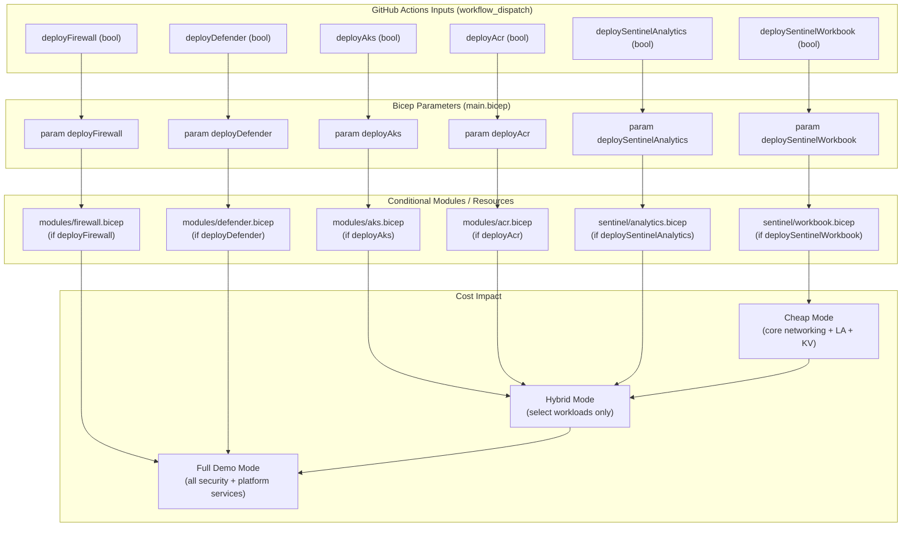
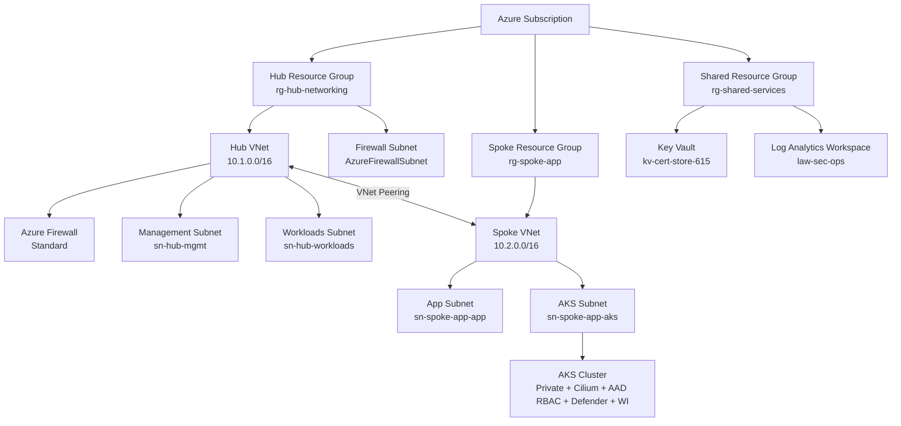

# Azure IaC Foundation — Modular Hub-Spoke Deployment Framework

[](https://github.com/CamParent/iac-foundation/actions/workflows/deploy.yml)
[](https://github.com/CamParent/iac-foundation/actions/workflows/aks-deploy.yml)
[](https://github.com/CamParent/iac-foundation/actions/workflows/sentinel-rule-deploy.yaml)
[](https://github.com/CamParent/iac-foundation/actions/workflows/terraform-plan.yml)
[](https://github.com/CamParent/iac-foundation/actions/workflows/terraform-aws-hub-spoke.yml)

This repository defines a **modular, production-lean cloud landing zone** with:

- **Azure** hub–spoke networking, AKS, Policy, and Microsoft Sentinel — built in **Bicep**
- A **parallel Terraform implementation** for Azure networking/AKS
- A separate **AWS hub–spoke + Transit Gateway + SSM lab** in Terraform
- **GitHub Actions CI/CD** using **OIDC** for both Azure and AWS (no stored cloud keys)
- Built-in **cost governance** via feature toggles and plan-only pipelines

It’s designed to showcase how a platform engineer can:

- Build secure base infrastructure
- Automate deployments end-to-end
- Enforce governance and observability
- Control cloud spend intentionally

---

## 🔍 High-Level Highlights

- **Bicep-based modular Azure architecture**  
  Hub, spoke, AKS, Firewall, Key Vault, Policy, peering, Defender, Sentinel.

- **Private AKS cluster**  
  Cilium dataplane, Azure AD RBAC, Defender for Cloud, Workload Identity, private API.

- **GitHub Actions CI/CD with OIDC**  
  - Azure: Bicep deploy, AKS app deploy, Sentinel rule deployment, Terraform plan  
  - AWS: Terraform plan for hub–spoke + SSM lab

- **Governance-as-Code**  
  Azure Policy for region, tags, and AKS posture.

- **Security & SIEM integration**  
  Microsoft Sentinel workbooks, analytics rules, and an ingest lab.

- **Cost controls everywhere**  
  Expensive components (Firewall, AKS, Defender, Sentinel analytics) are opt-in.

---

## Terraform Variant (Azure Hub–Spoke + AKS + OIDC CI/CD)

A **parallel Terraform implementation** of the Azure hub–spoke landing zone lives under [`/terraform`](./terraform).  
It mirrors the enterprise networking and cost-governance principles from the Bicep deployment.

### 📁 Azure Terraform Structure

- `terraform/modules/networking` – Hub resource group + hub VNet  
- `terraform/modules/spoke-networking` – Spoke resource group, spoke VNet, bidirectional peering  
- `terraform/modules/aks` – Optional AKS cluster with subnet injection + cost toggle  
- `terraform/envs/lab` – Opinionated “lab” environment wiring the modules together  

When deployed, it creates:

- `rg-hub-networking-tf` / `vnet-hub-01-tf`
- `rg-spoke-apps-tf` / `vnet-spoke-01-tf`
- Hub ↔ Spoke VNet peering
- **Optional** AKS cluster in the spoke VNet

---

### 🚦 Azure Terraform AKS Cost Toggle

AKS is **opt-in** for cost safety:

| Variable      | Default | Behavior                                      |
|---------------|---------|-----------------------------------------------|
| `deploy_aks`  | `false` | Hub + spoke + peering only (cheap mode)      |
| `deploy_aks`  | `true`  | Adds AKS cluster and AKS subnet (demo mode)  |

Example commands:

```bash
# Baseline hub–spoke only (cheap mode)
terraform apply

# Full demo mode with AKS (costs money)
terraform apply -var "deploy_aks=true"

# Remove AKS but keep networking
terraform apply -var "deploy_aks=false"

# Destroy entire Terraform lab
terraform destroy -var "deploy_aks=true"
```

The Terraform lab is kept destroyed by default and only launched
intentionally for demos or validation.

### 🔁 Azure Terraform CI/CD (OIDC-Based, Plan-Only)

The workflow `.github/workflows/terraform-plan.yml` runs:
 - `terraform init`
 - `terraform fmt`
 - `terraform validate`
 - `terraform plan`

using OIDC-based auth to Azure (no stored secrets).

The workflow exposes a UI toggle:

 `[ ] Include AKS in Terraform plan (costs money if applied)`

This allows safe previewing of AKS-related changes without applying them.

### 🛡️ Why Terraform Is Included (Azure)

The Azure Terraform variant demonstrates:
 - **Multi-IaC proficiency – Bicep and Terraform**
 - **Provider-driven automation**
 - **Hub–spoke networking expressed in both languages**
 - **Cost-aware optional workloads**
 - **OIDC-based, secretless CI/CD**

This mirrors how real platform teams often support **both native and third-party IaC tooling side-by-side.**

---

## 💸 Cost Controls & Safe Lab Deployment (Azure)

This project bakes in **cost governance** so the environment stays affordable while still showcasing realistic architecture.

Because Azure Firewall, AKS node pools, and Defender plans can be expensive, the framework uses **toggle-based cost control** across Bicep and GitHub Actions.

### 🔧 Deploy-Time Feature Toggles (Bicep Parameters)

Each major component is **opt-in**, helping prevent accidental cost overruns:

| Feature                         | Parameter                   | Default | Notes                                                     |
|---------------------------------|-----------------------------|---------|-----------------------------------------------------------|
| **Azure Firewall (expensive)**  | `deployFirewall`            | `false` | Avoids accidental \$300–\$1000/month Firewall charges     |
| **AKS Cluster**                 | `deployAks`                 | `false` | No nodes = no VM cost; deploy only when needed            |
| **Defender for Cloud (AKS)**    | `deployDefender`            | `false` | Defender plan charges kept off by default                 |
| **Azure Container Registry**    | `deployAcr`                 | `false` | Optional ACR for AKS workloads                            |
| **Sentinel Analytics Rules**    | `deploySentinelAnalytics`   | `false` | Heavy log ingestion intentionally optional                |
| **Sentinel Workbook**           | `deploySentinelWorkbook`    | `true`  | Visual SOC overview included by default                   |

---

### 🚦 Cost Controls in GitHub Actions (`deploy.yml`)

The Bicep CI/CD workflow exposes the same feature toggles through  
**`workflow_dispatch` inputs**, allowing safe, intentional deployments.

#### Deployment Modes

| Mode            | Description                                                                 |
|-----------------|-----------------------------------------------------------------------------|
| **Cheap Mode**  | Hub, spoke, Log Analytics, Key Vault, Sentinel workbook                      |
| **Full Demo**   | Optionally adds AKS, Azure Firewall, Defender for Cloud, ACR, analytics     |
| **Hybrid Mode** | Mix and match (e.g., AKS without Firewall, Sentinel without Defender)       |

#### Example GitHub Actions UI

```text
[ ] Deploy Azure Firewall (expensive)
[x] Deploy Sentinel Workbook
[ ] Deploy Sentinel Analytics
[ ] Deploy AKS Cluster
[ ] Enable Defender for Cloud (AKS)
```

This prevents accidentally deploying expensive resources during normal iteration.

### 🧠 Cost Toggle Flow (GitHub Actions → Bicep → Azure)



### 👍 Expected Monthly Cost (Cheap Mode)

With `deployFirewall=false` and `deployAks=false`, baseline Azure costs stay low:

| Component                              | Estimated Cost |
|----------------------------------------|----------------|
| Log Analytics (30 days retention)      | ~$2–$5         |
| Key Vault                              | ~$1            |
| Storage + misc                         | ~$1–$2         |
| Resource groups, VNets, route tables   | **$0**         |

**Total (cheap mode): ~$5–$10 per month**

Full demo mode costs more (AKS node pools, Azure Firewall, Defender plans),  
but only when **explicitly enabled via CI/CD toggles**.

---

## 🌎 Azure Architecture Overview



---

## 📁 Repository Structure (Azure)

```text
.
├── main.bicep                      # Subscription-scope entrypoint
├── modules/                        # Reusable infra modules
│   ├── networking.bicep            # Hub VNet
│   ├── spoke-networking.bicep      # Spoke VNet
│   ├── firewall.bicep              # Azure Firewall
│   ├── keyvault.bicep              # Shared Key Vault
│   ├── policy.bicep                # Policy definitions + assignments
│   ├── peering.bicep               # Hub ↔ Spoke peering
│   ├── defender.bicep              # Defender integration
│   └── aks.bicep                   # AKS cluster (optional)
├── policies/                       # JSON policies used by policy.bicep
├── sentinel/
│   ├── analytics/                  # Sentinel analytic rule templates (JSON)
│   ├── ingest-lab/                 # Simulated ingestion via DCR + AMA
│   └── workbooks/                  # Workbook definitions (JSON)
└── .github/workflows/
    ├── deploy.yml                  # Azure infra validation & deploy (Bicep + what-if)
    ├── aks-deploy.yml              # Sample app deployment to AKS
    ├── sentinel-rule-deploy.yaml   # Sentinel analytics deployment with validation
    ├── terraform-plan.yml          # Azure Terraform plan (OIDC to Azure)
    └── terraform-aws-hub-spoke.yml # AWS Terraform plan (OIDC to AWS)
```

---

## 🚀 GitHub Actions (Azure CI/CD)

Infra Deployment — `deploy.yml`
 - Trigger: push to `main` or manual dispatch
 - Steps:
    - Bicep syntax validation
    - Subscription-scope `what-if`
    - Deployment with feature toggles

AKS App Deploy — `aks-deploy.yml`
 - Deploys a sample app (`hello-world.yaml`) to the private AKS cluster
 - Authenticates via OIDC
 - Uses `az aks command invoke` to reach the private cluster

Sentinel Rules — `sentinel-rule-deploy.yaml`
 - Validates JSON structure and required tags
 - Deploys all `.json` rules from `sentinel/analytics/` via `az rest`
 - Enforces metadata such as:

```json
 "tags": {
  "Environment": "lab",
  "Owner": "cparent",
  "Project": "iac-foundation",
  "DeployedBy": "github-actions"
}
```

---

## 🚒 Optional AKS Cluster (Azure)

When `deployAks=true`, the AKS cluster includes:

| Feature   | Value                    |
|-----------|--------------------------|
| Type      | Private                  |
| CNI       | Azure CNI (Overlay)      |
| Dataplane | Cilium                   |
| RBAC      | Azure AD RBAC            |
| Defender  | Enabled                  |
| Identity  | Workload Identity + OIDC |

Sample deployment command:

```bash
az aks command invoke \
  --resource-group rg-spoke-app \
  --name spoke-app-aks \
  --command "kubectl apply -f hello-world.yaml" \
  --file ./samples/aks-basic-deploy/hello-world.yaml
```

---

## 🛰️ Sentinel Automation & Ingest Lab

Telemetry flows into **`law-sec-ops`** from:

- **Azure Firewall** logs  
- **Defender for Cloud (AKS)**  
- A **Windows VM (`sentinelvm01`)** via **Azure Monitor Agent (AMA)** and a **Data Collection Rule (DCR)**  

### 🔍 Analytics Rules

- Located in `sentinel/analytics/`
- Deployed via **GitHub Actions** using `az rest`
- Validated for required tags and schema compliance

### 🧪 Ingestion Lab

- `sentinelvm01` generates test security logs
- **DCR + AMA** forward logs to **Log Analytics**
- Data is queryable in **Microsoft Sentinel** using **KQL**

---

## ⚖️ Governance-as-Code (Azure Policy)

Azure governance is implemented declaratively using **`policy.bicep`**, which deploys and assigns custom Azure Policies such as:

| Policy name | Description |
|------------|-------------|
| `custom-allowed-locations` | Restrict resources to `eastus2` |
| `custom-require-standard-publicip` | Audit non-Standard public IPs |
| `custom-aks-audit-not-private` | Audit AKS clusters with public API endpoints |
| `custom-aks-audit-no-rbac` | Audit AKS clusters without RBAC enabled |

Policy assignments (`asg3-*`) are scoped at the **subscription level**.

---

## ☁️ AWS Hub–Spoke + SSM Lab (Terraform)

In addition to Azure, this repository includes a **small AWS hub–spoke lab** managed with Terraform under:

```text
terraform/aws/hub-spoke-ssm/
```

This lab demonstrates:

- Bringing **brownfield AWS infrastructure** under Terraform using `terraform import`
- **Hub–spoke VPC design** implemented with an **AWS Transit Gateway**
- **Private instance management** using **AWS Systems Manager (Session Manager)** and VPC interface endpoints
- **S3 access from private subnets** using **VPC Gateway Endpoints**
- **Controlled ICMP-only connectivity** for clean routing validation

---

## 🧱 AWS Lab Topology

**Region:** `us-east-2`

### 📍 Addressing

- **Hub VPC** – `10.0.0.0/16` (`aws_vpc.hub`)
- **Spoke VPC** – `10.1.0.0/16` (`aws_vpc.spoke`)

### 🏗️ Hub VPC

**Private subnets across AZs:**

- `hub-private-a-1`
- `hub-private-a-2`
- `hub-private-b-1`
- `hub-private-b-2`

**Internet Gateway:**

- `hub-igw`

**Route tables:**

- **`hub-rtb-public`**
  - `0.0.0.0/0` → Internet Gateway
  - `10.1.0.0/16` → Transit Gateway

- **`hub-rtb-private1-us-east-2a`**
  - `10.1.0.0/16` → Transit Gateway

- **`hub-rtb-private2-us-east-2b`**
  - `10.1.0.0/16` → Transit Gateway

- **`hub_main`**
  - Default main route table

### 🏗️ Spoke VPC

**Public subnets:**

- `spoke-subnet-public1-us-east-2a`
- `spoke-subnet-public2-us-east-2b`

**Private subnets:**

- `spoke-subnet-private1-us-east-2a`
- `spoke-subnet-private2-us-east-2b`

**Internet Gateway:**

- `spoke-igw`

**Route tables:**

- **`spoke-rtb-public`**
  - `0.0.0.0/0` → Internet Gateway

- **`spoke-rtb-private1-us-east-2a`**
  - `10.0.0.0/16` → Transit Gateway
  - S3 prefix list → **S3 Gateway Endpoint**

- **`spoke-rtb-private2-us-east-2b`**
  - Same as above

- **`spoke_main`**
  - Default main route table

### 🔁 Transit Gateway

- **`aws_ec2_transit_gateway.lab`**

**Attachments:**

- `tgw-attach-hub` – Hub VPC
- `tgw-attach-spoke` – Spoke VPC

This yields a **clean, symmetric hub–spoke topology** analogous to the Azure design, but implemented using **AWS VPCs + Transit Gateway**.

---

## 🔐 Private Management Path (SSM + VPC Endpoints)

Instance management is performed via **AWS Systems Manager (Session Manager)** — **no public IPs required**.

### Hub VPC Endpoints

- **`aws_vpc_endpoint.s3`** – S3 **Gateway** endpoint for hub private route tables
- **`aws_vpc_endpoint.ssm`** – SSM **Interface** endpoint
- **`aws_vpc_endpoint.ssmmessages`** – SSMMessages **Interface** endpoint
- **`aws_vpc_endpoint.ec2messages`** – EC2Messages **Interface** endpoint

All interface endpoints use a dedicated security group:

**`aws_security_group.ssm_endpoints`**

- **Ingress:** TCP 443 from `10.0.0.0/16`
- **Egress:** All outbound traffic allowed

**Hub management instance:**

```hcl
resource "aws_instance" "hub_test" {
  ami                    = "ami-00e428798e77d38d9"
  instance_type          = "t3.micro"
  subnet_id              = aws_subnet.private_a_2.id
  vpc_security_group_ids = [aws_security_group.ssm_endpoints.id]
  iam_instance_profile   = aws_iam_instance_profile.ec2_ssm_role.name

  tags = {
    Name = "hub-test"
  }
}
```

- Lives in a **private subnet**
- Managed via **Session Manager** over VPC endpoints
- Uses `ec2-ssm-role` for SSM access

---

## 🌐 Connectivity Lab: Hub ↔ Spoke ICMP

ICMP-only security groups validate Transit Gateway routing and segmentation.

**Hub ICMP security group — `aws_security_group.lab_icmp` (Hub VPC):**

  - Allows ICMP (all) between `10.0.0.0/16` and `10.1.0.0/16`.

**Spoke ICMP security group — aws_security_group.spoke_icmp (Spoke VPC):**

  - Allows ICMP (all) from both `10.0.0.0/16` and `10.1.0.0/16`.

**Spoke test instance:**

```hcl
resource "aws_instance" "spoke_test" {
  ami                    = "ami-00e428798e77d38d9"
  instance_type          = "t3.micro"
  subnet_id              = aws_subnet.spoke_private_a.id
  vpc_security_group_ids = [aws_security_group.spoke_icmp.id]

  tags = {
    Name = "spoke-test"
  }
}
```

---

## ✅ Validation Tests (From hub-test via SSM)

From the **hub-test** EC2 instance (connected via Session Manager):

🔹 **Transit Gateway + SG validation**

```bash
ping <spoke-private-ip>
```

Confirms hub ↔ spoke routing over the Transit Gateway.

🔹 **S3 gateway endpoint validation**

```bash
aws s3 ls
```

Confirms private-subnet S3 access via the gateway endpoint.

---

## 📁 AWS Terraform Layout

```text
terraform/
  aws/
    hub-spoke-ssm/
      main.tf
      vpc.tf
      subnets.tf
      internet-gateway.tf
      route-tables.tf
      route-table-associations.tf
      vpc-endpoints.tf
      security-groups.tf
      ec2-instances.tf
      iam.tf
      transit-gateway.tf
```

---

## 🔁 AWS Terraform CI/CD (OIDC-Based, Plan-Only)

The AWS lab is wired to a dedicated **GitHub Actions workflow**:

`.github/workflows/terraform-aws-hub-spoke.yml`

### What This Workflow Does

- Assumes an **AWS IAM role via GitHub OIDC**
  - Uses `aws-actions/configure-aws-credentials`
- Executes the following Terraform commands:
  - `terraform fmt`
  - `terraform init`
  - `terraform validate`
  - `terraform plan`

### What It Explicitly Does *Not* Do

- ❌ **Does not run `terraform apply` automatically**
- ❌ **Does not destroy resources from CI/CD**

All **apply** and **destroy** operations are intentionally run **manually from the CLI** to prevent accidental spend.

### Why This Pattern Is Used

This design intentionally demonstrates:

- **Secretless CI/CD to AWS** using federated identity (OIDC)
- A **safe, plan-only pipeline** suitable for cost-sensitive labs
- Terraform acting as a **“flight recorder”** for imported/brownfield AWS infrastructure

---

## 👤 Author

**Cameron Parent** — Network & Cloud Engineer • Azure Security Engineer • CISSP

🔗 LinkedIn: https://www.linkedin.com/in/camjosephparent/