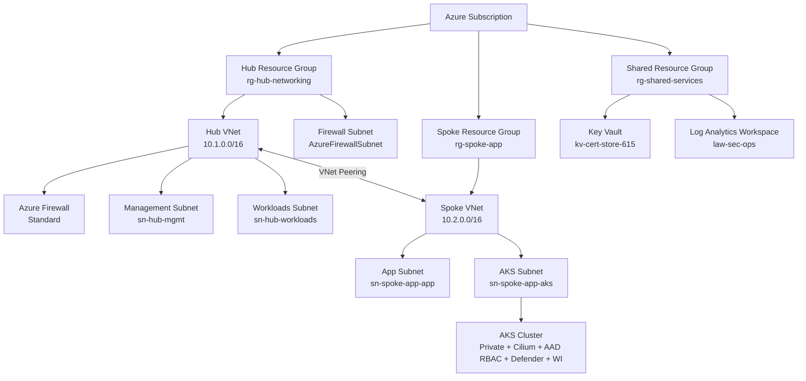

# Azure IaC Foundation — Modular Hub-Spoke Deployment Framework
[](https://github.com/CamParent/iac-foundation/actions/workflows/deploy.yml)
[](https://github.com/CamParent/iac-foundation/actions/workflows/aks-deploy.yml)
[](https://github.com/CamParent/iac-foundation/actions/workflows/sentinel-rule-deploy.yaml)

This repository defines a **modular, production-lean Azure infrastructure** using **Bicep**, **GitHub Actions**, and **Azure-native governance** principles.

It provides a complete Azure landing zone with CI/CD, secure AKS, and Microsoft Sentinel integration — designed for:
  - Security-conscious deployments
  - DevSecOps pipelines (OIDC-based)
  - Policy-driven governance
  - Sentinel automation and telemetry readiness

---

## 🔍 Highlights

- **Bicep-based modular architecture** (Hub/Spoke/AKS/Policy/Firewall)
- **Private AKS cluster** with Cilium, AAD RBAC, Defender, Workload Identity
- **GitHub Actions CI/CD** for:
  - Infra validation/deployment
  - AKS workload deployment
  - Sentinel Analytics automation
- **Azure Policy as code** for region/tag/AKS enforcement
- **Microsoft Sentinel**: rules, ingestion lab, and automation workflows

---

## 🌎 Architecture Overview



---

## 🔮 Repository Structure

```text
.
├── main.bicep                      # Subscription-scope entrypoint
├── modules/                        # Reusable infra modules
│   ├── networking.bicep            # Hub VNet
│   ├── spoke-networking.bicep      # Spoke VNet
│   ├── firewall.bicep              # Azure Firewall
│   ├── keyvault.bicep              # Shared Key Vault
│   ├── policy.bicep                # Policy definitions + assignments
│   ├── peering.bicep               # Hub ↔ Spoke peering
│   ├── defender.bicep              # Defender integration
│   └── aks.bicep                   # AKS cluster (optional)
├── policies/                       # JSON policies used by policy.bicep
├── sentinel/
│   ├── analytics/                  # Sentinel analytic rule templates (JSON)
│   ├── ingest-lab/                 # Simulated ingestion via DCR + AMA
│   └── workbooks/                  # Workbook definitions (JSON)
└── .github/workflows/
    ├── deploy.yml                  # Infra validation & deploy (Bicep what-if)
    ├── aks-deploy.yml              # Sample app deployment to AKS
    └── sentinel-rule-deploy.yaml    # Sentinel automation with validation
```

---

## 🚀 GitHub Actions (CI/CD)
 
### Infra Deployment: deploy.yml
  - Runs on push or manual dispatch
  - Validates Bicep syntax
  - Performs what-if against subscription
  - Deploys infrastructure on approval

### AKS App Deploy: aks-deploy.yml
  - Deploys sample app (hello-world.yaml) to private AKS
  - Authenticates via OIDC
  - Uses az aks command invoke to reach private cluster

### Sentinel Rules: sentinel-rule-deploy.yaml
  - Validates JSON structure + required tags
  - Deploys all .json rules from sentinel/analytics/
  - Uses az rest + OIDC login

Validation step ensures rules include mandatory metadata:

```json
"tags": {
"Environment": "lab",
"Owner": "cparent",
"Project": "iac-foundation",
"DeployedBy": "github-actions"
}
```

---

## 🚒 Optional AKS Cluster

Deployed with deployAks=true, this cluster includes:

| Feature | Value |
|--------|-------|
| Type | Private |
| CNI | Azure CNI (Overlay) |
| Dataplane | Cilium |
| RBAC | Azure AD RBAC |
| Defender | Enabled |
| Workload Identity | Enabled |
| OIDC | Enabled |

Sample deployments:

```bash
az aks command invoke \
--resource-group rg-spoke-app \
--name spoke-app-aks \
--command "kubectl apply -f hello-world.yaml" \
--file ./samples/aks-basic-deploy/hello-world.yaml
```

---

## Sentinel Automation & Ingest Lab

Sentinel-ready telemetry flows into law-sec-ops from:
  - Azure Firewall logs
  - Defender for Cloud (AKS)
  - AMA from sentinelvm01 via DCR (ingest lab)

### Analytics Rule Deployment
  - Rules live in sentinel/analytics/
  - Deployed via az rest
  - GitHub Action enforces tag compliance and structure

### Ingestion Lab
  - sentinelvm01 Windows VM runs test log generato
  - Data Collection Rule (DCR) + AMA collects Security logs
  - Logs visible in Sentinel workspace via KQL

---

## ⚖️ Governance-as-Code (Azure Policy)

Deployed via policy.bicep:

| Name | Description |
|--------|-------|
| custom-allowed-locations | Restrict to eastus2 |
| custom-require-standard-publicip | Audit non-Standard IPs |
| custom-aks-audit-not-private | Audit public AKS API |
| custom-aks-audit-no-rbac | Audit AKS clusters with RBAC off |

Assignments (asg3-*) scoped at subscription level.

---

## Author

Cameron Parent — Network & Cloud Engineer • Azure Security Engineer • CISSP

LinkedIn: https://www.linkedin.com/in/camjosephparent/