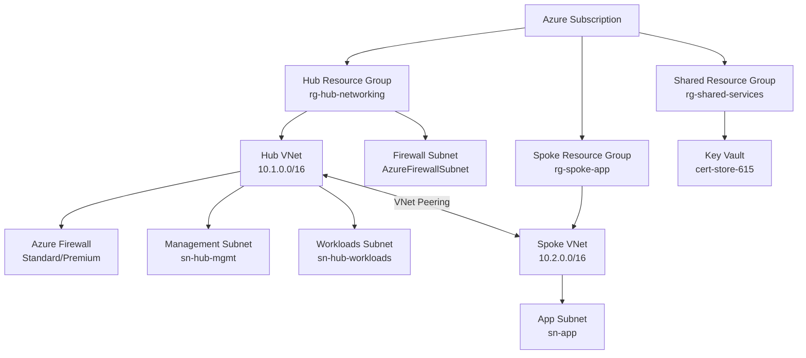

# Azure IaC Foundation — Modular Hub-Spoke Deployment Framework
[](https://github.com/CamParent/iac-foundation/actions/workflows/bicep-validate.yml)

This repository defines a **modular, production-ready Azure infrastructure** built entirely with **Bicep**, following  
best practices for **Infrastructure-as-Code (IaC)** and **GitHub Actions-based CI/CD validation**.

It provisions a **hub-and-spoke network architecture** designed for enterprise workloads—centralizing security, shared services, and network management—while allowing flexible expansion for new applications and environments.

**Highlights**
- **Modular Bicep Design** – Reusable templates for networking, security, and shared services
- **CI/CD Integration** – Automated syntax validation and what-if deployments via GitHub Actions
- **Enterprise-Grade Architecture** – Hub-spoke topology with Azure Firewall, Key Vault, and resource isolation
- **Future-Ready Expansion** – Supports optional integrations such as Bastion, VPN Gateway, and Application Gateway + WAF


---

## Architecture


> **Note:** Future integrations (VPN Gateway, Bastion, Application Gateway + WAF, Private Endpoints) are planned for modular expansion.

### Hub Network (`rg-hub-networking`)
- Central VNet for shared infra
- Subnets: `AzureFirewallSubnet`, `sn-hub-mgmt`, `sn-hub-workloads`
- Azure Firewall (Standard or Premium)

### Spoke Network (`rg-spoke-app`)
- Application VNet with dedicated app subnet
- Bidirectional peering with the hub

### Shared Services (`rg-shared-services`)
- Azure Key Vault for certificates and secrets

**Future-ready**: VPN/ExpressRoute Gateways, Bastion, Application Gateway + WAF, Private Endpoints.

---

## Repository Layout

```text
.
├── main.bicep                      # Subscription-scope orchestration
├── modules/
│   ├── networking.bicep            # Hub VNet + subnets
│   ├── spoke-networking.bicep      # Spoke VNet + app subnet
│   ├── firewall.bicep              # Azure Firewall deployment
│   ├── keyvault.bicep              # Shared Key Vault (optional)
│   ├── policy.bicep                # Azure Policy (defs + assignments wired to JSON)
│   └── peering.bicep               # Hub ↔ Spoke VNet peering
├── policies/
│   ├── allowed-locations.json      # Custom policy: restrict regions
│   ├── enforce-tags.json           # Custom policy: require tag keys
│   └── require-standard-publicip.json  # Custom policy: enforce Standard SKU Public IPs
└── .github/
    └── workflows/
        └── bicep-validate.yml      # CI: bicep build + what-if (OIDC login)
```

---

## Prerequisites

- Azure CLI (logged in)  
```bash
az login
```

- Bicep CLI ≥ 0.38
```bash
az bicep version
```

- Permissions to create:
  - Resource Groups
  - Virtual Networks
  - Azure Firewall
  - Key Vault

## Validate

Preview deployment changes:
```bash
az deployment sub what-if `
  --location eastus2 `
  --template-file .\main.bicep `
  --parameters namePrefixHub=hub namePrefixSpoke=spoke-app
```

## Deploy
```bash
az deployment sub create `
  --location eastus2 `
  --template-file .\main.bicep `
  --parameters namePrefixHub=hub namePrefixSpoke=spoke-app
```

## Expected Results

- Hub and Spoke VNets created and peered
- Azure Firewall with static public IP
- Optional Key Vault provisioned
- Consistent tagging across resource groups

## CI/CD Integration

This repository includes a GitHub Actions workflow that:

- Runs syntax validation on all Bicep templates
- Executes an automated Azure “what-if” deployment preview
- Authenticates securely using OpenID Connect (OIDC) federation with Azure

### 📘 CI/CD Validation Results

The latest **automated what-if deployment** was executed via GitHub Actions using OpenID Connect authentication.

✅ **Run #36** — [View Workflow Logs »](https://github.com/CamParent/iac-foundation/actions/runs/19154923538)  
📦 **Artifact:** [Download what-if-36.zip](https://github.com/CamParent/iac-foundation/actions/runs/19154923538#artifacts)

The `what-if` output confirms that the deployment would:
- **Create 7** new resources (custom Azure Policy Definitions + Assignments)
- **Modify 7** existing resources (resource group tagging, hub firewall, and Key Vault RBAC)
- **Ignore 20** unchanged resources (existing networking, routes, private endpoints, etc.)

**Highlights:**
- Enforces **Allowed Locations**, **Required Tags**, and **Standard SKU Public IP** Azure Policies  
- Adds consistent resource tagging across all resource groups  
- Updates Azure Firewall to **AlertAndDeny** mode with refined subnets  
- Enables **RBAC authorization** and **purge protection** in Key Vault  

> _This validation was fully automated through GitHub Actions, ensuring every infrastructure change is tested through Azure’s native “what-if” before deployment._

## Next Steps

- Integrate Azure Policy for compliance and governance
- Extend CI/CD pipelines for automated deployments
- Add Azure Bastion and Application Gateway + WAF for production readiness
- Connect Log Analytics + Azure Monitor for observability

Author

Cameron Parent — Network & Cloud Engineer • Azure Security Engineer • CISSP

LinkedIn: https://www.linkedin.com/in/camjosephparent/
