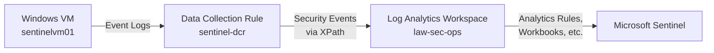

# Microsoft Sentinel Log Ingestion Lab

This lab simulates and validates the ingestion of **Windows Security Event Logs** into Microsoft Sentinel via **Azure Monitor Agent (AMA)** and a **Data Collection Rule (DCR)**, with automated rule deployment through **GitHub Actions**.

## 🎯 Skills Demonstrated
- Azure Monitor Agent installation and configuration
- Data Collection Rule (DCR) authoring and VM association
- Log Analytics Workspace (LAW) integration
- Microsoft Sentinel readiness and alert rule deployment
- Event simulation + validation with **Kusto Query Language (KQL)**
- CI/CD for analytics rules with validation + tagging

## 🧱 Prerequisites
Before deploying, ensure:
- A test VM named sentinelvm01 exists in resource group rg-sec-test
- A Log Analytics Workspace named law-sec-ops is deployed
- Azure CLI is installed and authenticated
- You have Contributor permissions on the target resource group

## 🚀 Deploy AMA + DCR via Script
This command installs AMA, configures a DCR, and associates it with the VM:

```powershell
cd .\sentinel\ingest-lab\
.\deploy.ps1
```

## 🧪 Simulate Security Events (4625)
To generate test security events on the VM:

```powershell
.\simulate-events.ps1
```

Ingested logs can be queried in Sentinel > Logs using:

```kusto
SecurityEvent
| where EventID == 4625
| sort by TimeGenerated desc
```

Allow ~5 minutes for ingestion.

---

## 🖼️ Architecture Diagram



---

## 🔄 Sentinel Automation via GitHub Actions

Analytics rules under sentinel/analytics/ are validated and deployed via a GitHub Actions workflow (sentinel-rule-deploy.yaml):

### ✅ Workflow Capabilities
- **Trigger**: On push to sentinel/analytics/** or manual dispatch
- **Security**: Azure login via OIDC (no secrets stored)
- **Validation**: Ensures JSON syntax + required tags
- **Deployment**: Uses az rest with the Sentinel ARM API

### 🏷️ Required Tags for Each Rule

Each .json analytics rule must contain a tags block:

```json
"tags": {
  "Environment": "Dev",
  "Owner": "security-team@example.com",
  "Project": "iac-foundation",
  "DeployedBy": "GitHubActions"
}
```
Missing tags cause the pipeline to fail — ensuring traceability and compliance.

## 📂 File Structure

```text
sentinel/ingest-lab/
├── deploy.ps1                # Installs AMA + connects DCR
├── simulate-events.ps1       # Generates test security events (4625)
├── patched-dcr.json          # DCR definition wired to LAW
└── README.md                 # This file
```
Related folders:
  - sentinel/analytics/ — Alert rules deployed via CI/CD
  - sentinel/workbooks/ — Custom Sentinel workbook templates (optional)
---

## ✅ Next Steps
  - Create custom analytics rules under sentinel/analytics/
  - Confirm logs appear in Sentinel via SecurityEvent queries
  - Expand detection scenarios (e.g. impossible travel, brute force, etc.)
  - Integrate with dashboards or automated incident response