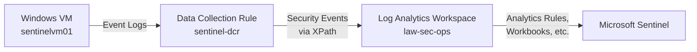

# Sentinel Log Ingestion Lab

This subproject simulates and verifies ingestion of Windows Security Events (e.g., Event ID 4625) into Azure Sentinel via the Azure Monitor Agent and a Data Collection Rule (DCR).

## 💼 Skills Demonstrated

- Azure Monitor Agent setup
- Data Collection Rule configuration (DCR)
- Log Analytics + Sentinel integration
- Kusto Query Language (KQL) usage
- SecurityEvent log simulation

## 🧱 Prerequisites

- Existing VM: `sentinelvm01` in `rg-sec-test`
- Log Analytics Workspace: `law-sec-ops` (ID already embedded in `patched-dcr.json`)
- Azure CLI installed
- Contributor access to resource group

## 🚀 Deploy and Connect Agent

```powershell
cd .\sentinel\ingest-lab\
.\deploy.ps1
```

## 🧪 Simulate Logs (Event ID 4625)

```powershell
.\simulate-events.ps1
```

Expected to appear in Sentinel > Logs using:

```kusto
SecurityEvent
| where EventID == 4625
| sort by TimeGenerated desc
```

Allow ~5 minutes for ingestion.

---
## 🖼️ Architecture



---

## ✅ Next Steps