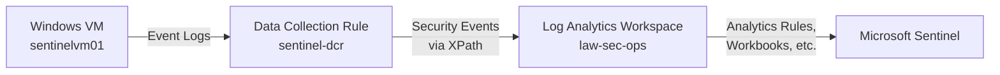

# Sentinel Log Ingestion Lab

This subproject simulates and verifies ingestion of Windows Security Events (e.g., Event ID 4625) into Azure Sentinel via the Azure Monitor Agent and a Data Collection Rule (DCR).

## 💼 Skills Demonstrated

- Azure Monitor Agent setup
- Data Collection Rule configuration (DCR)
- Log Analytics + Sentinel integration
- Kusto Query Language (KQL) usage
- SecurityEvent log simulation

## 🧱 Prerequisites

- Existing VM: `sentinelvm01` in `rg-sec-test`
- Log Analytics Workspace: `law-sec-ops` (ID already embedded in `patched-dcr.json`)
- Azure CLI installed
- Contributor access to resource group

## 🚀 Deploy and Connect Agent

```powershell
cd .\sentinel\ingest-lab\
.\deploy.ps1
```

## 🧪 Simulate Logs (Event ID 4625)

```powershell
.\simulate-events.ps1
```

Expected to appear in Sentinel > Logs using:

```kusto
SecurityEvent
| where EventID == 4625
| sort by TimeGenerated desc
```

Allow ~5 minutes for ingestion.

---
## 🖼️ Architecture



---

## 🔄 Sentinel Automation via GitHub Actions

This project now supports automated deployment of Sentinel analytics rules using GitHub Actions. Each .json rule file in sentinel/analytics/ is:
- ✅ Validated for proper JSON structure
- 🏷️ Checked for required metadata tags (Environment, Owner, Project, DeployedBy)
- 🚀 Deployed to Microsoft Sentinel via the Azure REST API

### 💼 GitHub Workflow Highlights
- Trigger: Runs on push to sentinel/analytics/** or manual trigger via GitHub UI
- Security: Uses [OIDC-based Azure login](https://learn.microsoft.com/en-us/azure/developer/github/connect-from-azure?tabs=azure-cli%2Clinux) (no secrets needed)
- Validation: Fails early if required tags are missing from any rule
- Deployment: Pushes alert rules directly to Sentinel via az rest using the Microsoft.SecurityInsights resource provider

### 📂 Required Tags in Each Rule JSON
Each rule must include a tags block like this:

```json
"tags": {
  "Environment": "Dev",
  "Owner": "security-team@example.com",
  "Project": "iac-foundation",
  "DeployedBy": "GitHubActions"
}
```

This ensures consistent rule ownership and traceability across deployments.

---

## ✅ Next Steps